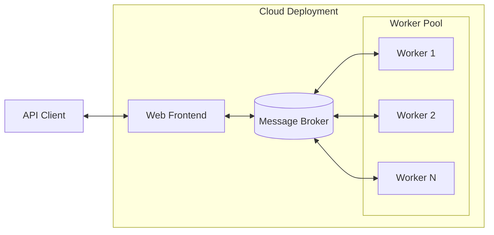

# Building Optimization Performance Tests (BOPTEST)

This repository contains code for the BOPTEST framework that is being developed as part of the [IBPSA Project 2](https://ibpsa.github.io/project1-boptest/ibpsa/index.html) and was previously developed as part of the [IBPSA Project 1](https://ibpsa.github.io/project1/).

Visit the [BOPTEST Home Page](https://ibpsa.github.io/project1-boptest/) for more information about the project, software, documentation, and [tutorials](https://ibpsa.github.io/project1-boptest/training/index.html).

## Structure
- ``/testcases`` contains test cases, including docs, models, and configuration settings.
- ``/service`` contains code for deploying BOPTEST framework as a web-service, known as BOPTEST-Service.
- ``/examples`` contains code for interacting with a test case and running example tests with simple controllers.  Those controllers are implemented in Python (3.9) and Julia (Version 1.0.3).
- ``/parsing`` contains code for a script that parses a Modelica model using signal exchange blocks and outputs a wrapper FMU and KPI json.
- ``/testing`` contains code for unit and functional testing of this software.  See the README there for more information about running these tests.
- ``/data`` contains code for generating and managing data associated with test cases.  This includes boundary conditions, such as weather, schedules, and energy prices, as well as a map of test case FMU outputs needed to calculate KPIs.
- ``/forecast`` contains code for returning boundary condition forecast, such as weather, schedules, and energy prices.
- ``/kpis`` contains code for calculating key performance indicators.
- ``/docs`` contains design documentation and delivered workshop content.
- ``/baselines`` contains scripts and data for baselining KPIs for test cases with their embedded control.
- ``/bacnet`` contains code for a bacnet interface.

## Quick-Start to Deploy and Use BOPTEST on a Local Computer
BOPTEST can be deployed and used on your own computing resource by following the steps below:

1) Download or Clone this repository.

2) Install [Docker](https://docs.docker.com/get-docker/).

3) Use Docker to build and run BOPTEST.  In the root of this repository, run the following command:

``docker compose up web worker provision``

- If you want to be able to deploy multiple test cases at the same time, append the argument ``--scale worker=n`` to the command above where ``n`` equals the number of test cases you want to be able to have running at the same time.
- If no request is made to a running test case for some time, the test case will be automatically stopped and the associated worker will be freed up.  By default this timeout is 15 minutes.  If you would like to change this timeout period, you can edit the environment variable ``BOPTEST_TIMEOUT`` in the ``.env`` file before starting BOPTEST with the command above.
- If you want to re-build the docker containers before deployment, for example to include updates to source code, append the argument ``--build`` to the command above.

4) In a separate process, use the API below to first select a test case to run, and then interact with it using your test controller.  Send API requests to ``http://127.0.0.1:80/<request>``

5) Shutdown BOPTEST by the command ``docker compose down`` executed in the root directory of this repository.  NOTE: This is the best and most complete way to shutdown BOPTEST to prevent issues upon redeployment.

## Quick-Start to Use BOPTEST through the Public Online Web-Service

BOPTEST is also available as a public web-service and can be used by following the step below:

1) Use the API below to first select a test case to run, and then interact with it using your test controller.  Send API requests to ``https://api.boptest.net/<request>``

## RESTful HTTP API
API requests that interact with a running test case (those that require a ``testid``) will return a JSON in the form ``{"status":<status_code_int>, "message":<message_str>, "payload":<relevant_return_data>}``. Status codes in ``"status"`` are integers: ``200`` for successful with or without warning, ``400`` for bad input error, or ``500`` for internal error.  Data returned in ``"payload"`` is the data of interest relvant to the specific API request, while the string in ``"message"`` will report any warnings or error messages to help debug encountered problems.

| Interaction                                                           | Request                                                   |
|-----------------------------------------------------------------------|-----------------------------------------------------------|
| List IBPSA BOPTEST test cases.                                                                                           | GET `testcases`                                             |
| Select an IBPSA BOPTEST test case and begin a new test. Returns a `testid` which is required by all APIs that interact with the test or provide test information.                                                            | POST ``testcases/{testcase_name}/select``. See the [Test Case](https://ibpsa.github.io/project1-boptest/testcases/index.html) page for options and documentation.          |
| Advance simulation with control input and receive measurements.        |  POST ``advance/{testid}`` with optional arguments ``<input_name_u>:<value>``, and corresponding ``<input_name_activate>:<0 or 1>``, where 1 enables value overwrite and 0 disables (0 is default)  |
| Initialize simulation to a start time using a warmup period in seconds.  Also resets point data history and KPI calculations.     |  PUT ``initialize/{testid}`` with required arguments ``start_time=<value>``, ``warmup_period=<value>``|
| Receive communication step in seconds.                                 |  GET ``step/{testid}``                                             |
| Set communication step in seconds.                                     |  PUT ``step/{testid}`` with required argument ``step=<value>``              |
| Receive sensor signal point names (y) and metadata.                          |  GET ``measurements/{testid}``                                     |
| Receive control signal point names (u) and metadata.                        |  GET ``inputs/{testid}``                                           |
| Receive test result data for the given point names between the start and final time in seconds. |  PUT ``results/{testid}`` with required arguments ``point_names=<list of strings>``, ``start_time=<value>``, ``final_time=<value>``|
| Receive test KPIs.                                                     |  GET ``kpi/{testid}``                                              |
| Receive test case name.                                                |  GET ``name/{testid}``                                             |
| Receive boundary condition forecast from current communication step for the given point names for the horizon and at the interval in seconds.   |  PUT ``forecast/{testid}`` with required arguments ``point_names=<list of strings>``, ``horizon=<value>``, ``interval=<value>``|
| Receive boundary condition forecast available point names and metadata. |  GET ``forecast_points/{testid}``                              |
| Receive current test scenario.                                         |  GET ``scenario/{testid}``                                   |
| Set test scenario. Setting the argument ``time_period`` performs an initialization with predefined start time and warmup period and will only simulate for predefined duration. |  PUT ``scenario/{testid}`` with optional arguments ``electricity_price=<string>``, ``time_period=<string>``, ``temperature_uncertainty=<string>``, ``solar_uncertainty=<string>``, ``seed=<int>``.  See the [Test Case](https://ibpsa.github.io/project1-boptest/testcases/index.html) page for options and documentation.|
| Get test status as `Running` or `Queued`                                                                                    | GET ``status/{testid}``                                    |
| Stop a queued or running test.  Needed to deploy a new test case when no more idle workers are avaiable.                                                                                              | PUT ``stop/{testid}``                                      |
| Receive BOPTEST version.                                               |  GET ``version/{testid}``                                             |

API requests for more advanced test case management in the web-service architecture can be found in ``/service/README.md``.

## Run an example test controller:

* For Python-based example controllers:
  * Optionally, add the directory path to the root of this repository to the ``PYTHONPATH`` environment variable. Use ``export PYTHONPATH=$(pwd):$PYTHONPATH``. Note: The Python example updates the ``PYTHONPATH`` just in time.
  * Build and deploy ``testcase1``.  Then, in a separate terminal, use ``$ cd examples/python/ && python testcase1.py`` to test a simple proportional feedback controller on this test case over a two-day period.
  * Build and deploy ``testcase1``.  Then, in a separate terminal, use ``$ cd examples/python/ && python testcase1_scenario.py`` to test a simple proportional feedback controller on this test case over a test period defined using the ``/scenario`` API.
  * Build and deploy ``testcase2``.  Then, in a separate terminal, use ``$ cd examples/python/ && python testcase2.py`` to test a simple supervisory controller on this test case over a two-day period.

* For Julia-based example controllers:
  * Build and deploy ``testcase1``.  Then, in a separate terminal, use ``$ cd examples/julia && make build Script=testcase1 && make run Script=testcase1`` to test a simple proportional feedback controller on this test case over a two-day period.  Note that the Julia-based controller is run in a separate Docker container.
  * Build and deploy ``testcase2``.  Then, in a separate terminal, use ``$ cd examples/julia && make build Script=testcase2 && make run Script=testcase2`` to test a simple supervisory controller on this test case over a two-day period.  Note that the Julia-based controller is run in a separate Docker container.
  * Once either test is done, use ``$ make remove-image Script=testcase1`` or ``$ make remove-image Script=testcase2`` to removes containers, networks, volumes, and images associated with these Julia-based examples.

## BOPTEST-Service Deployment Architecture

BOPTEST is deployed by a web service architecture, known as BOPTEST-Service and located in ``/service``, which enables support for multiple clients and multiple simultaneous tests at a large scale. This is a containerized design that can be deployed on a personal computer, however the software is targeted at commercial cloud computing environments such as AWS.

BOPTEST-Service is a sibling of [Alfalfa](https://github.com/NREL/alfalfa), which follows the same architecture, but adopts a more general purpose API to support interactive building simulation, whereas the BOPTEST API is designed around predetermined test scenarios.

The message broker is implemented using Redis, for more information see ``service/docs/redis.md``.  Not shown is S3-compatible object storage for persisting test cases and other artifacts produced while a test is running, for more information see ``service/docs/object_storage.md``.

### BOPTEST-Service APIs

The BOPTEST-Service offers a number of additional APIs in addition to those listed above for the purpose of managing test cases and running tests, some of which require authorization.

| Description                                                                                                                 | Request                                                    |
| --------------------------------------------------------------------------------------------------------------------------- | -------------------------------------------
| List official BOPTEST test cases.                                                                                           | GET `testcases`                                            |
| List unofficial test cases in a namespace.                                                                                  | GET `testcases/{namespace}`                                |
| List private user test cases. (Auth required)                                                                               | GET `users/{username}/testcases/`                          |
| Check if specific test case exists.                                                                                         | GET `testcases/{testcase_name}`                            |
| Check if specific test case exists in the namespace.                                                                        | GET `testcases/{namespace}/{testcase_name}`                |
| Check if specific private user test case exists.                                                                            | GET `users/{username}/testcases/{testcase_name}`           |
| Select a test case and begin a new test. (Auth optional)                                                                    | POST ``testcases/{testcase_name}/select``                  |
| Select a test case from the namespace and begin a new test. (Auth optional)                                                 | POST ``testcases/{namespace}/{testcase_name}/select``      |
| Select a private user test case and begin a new test. (Auth required)                                                       | POST ``users/{username}/testcases/{testcase_name}/select`` |
| Get test status as `Running` or `Queued`                                                                                    | GET ``status/{testid}``                                    |
| Stop a queued or running test.                                                                                              | PUT ``stop/{testid}``                                      |
| List tests for a user. (Auth required)                                                                                      | GET ``users/{username}/tests``                             |

The family of the `select` APIs are used to choose a test case and begin a running test. Select returns a `testid` which is required by all APIs that interact with the test or provide test information.

### Kubernetes Based Deployment

NREL maintains a helm chart for Kubernetes based deployments of BOPTEST-Service.

## Development
Community development is welcome through reporting [issues](https://github.com/ibpsa/project1-boptest/issues) and/or making pull requests. If making a pull request,
make sure an issue is opened first, name the development branch according to the convention ``issue<issue#>_<descriptor>``, and cite in the pull request which issue is being addressed.

This repository uses pre-commit to ensure that the files meet standard formatting conventions (such as line spacing, layout, etc).
Presently only a handful of checks are enabled and will expanded in the near future. To run pre-commit first install
pre-commit into your Python version using pip `pip install pre-commit`. Pre-commit can either be manually by calling
`pre-commit run --all-files` from within the BOPTEST checkout directory, or you can install pre-commit to be run automatically
as a hook on all commits by calling `pre-commit install` in the root directory of the BOPTEST GitHub checkout.

## Additional Software

### OpenAI-Gym Environment Interface
An OpenAI-Gym environment interface for BOPTEST is implemented in [ibpsa/project1-boptest-gym](https://github.com/ibpsa/project1-boptest-gym).
See the documentation there for getting started.

### BACnet Interface
A BACnet interface for BOPTEST is implemented in the ``/bacnet`` directory of this repository.  See the ``/bacnet/README.md`` there for getting started.

### Julia Interface
A Julia interface for BOPTEST is implemented as a Julia package in [BOPTestAPI.jl](https://terion-io.github.io/BOPTestAPI.jl/stable/).
See the documentation there for getting started.

### Results Dashboard
A proposed BOPTEST home page and dashboard for creating accounts and sharing results is published here https://xd.adobe.com/view/0e0c63d4-3916-40a9-5e5c-cc03f853f40a-783d/.

## Use Cases and Development Requirements
See the [wiki](https://github.com/ibpsa/project1-boptest/wiki) for use cases and development requirements.

## Publications

### To cite, please use:
D. Blum, J. Arroyo, S. Huang, J. Drgona, F. Jorissen, H.T. Walnum, Y. Chen, K. Benne, D. Vrabie, M. Wetter, and L. Helsen. (2021). ["Building optimization testing framework (BOPTEST) for simulation-based benchmarking of control strategies in buildings."](https://doi.org/10.1080/19401493.2021.1986574) *Journal of Building Performance Simulation*, 14(5), 586-610.

### Additional publications:
See the [Publications](https://ibpsa.github.io/project1-boptest/publications/index.html) page.
