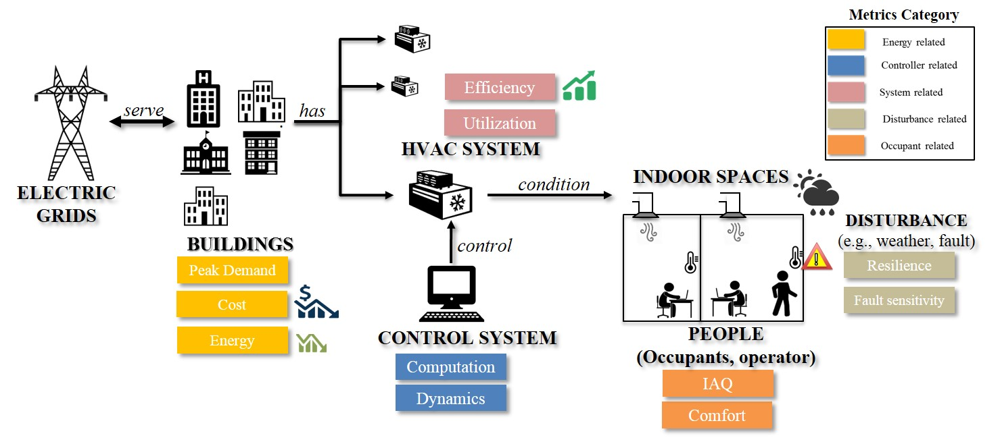

.. _SecAppKpi:

Appendix: Additional KPI Specification and Calculation
======================================================

Summary
-----------------

Advanced building controls are increasingly critical to achieve high
energy efficiency, demand flexibility, and occupant comfort in
buildings. However, large-scale adoption of emerging building control
strategies requires verified performance. When performing verification,
key performance indicators (KPIs) are necessary, which quantify
performances of those building control strategies. Designing KPIs can be
challenging, as they should not only capture how controls impacts the
different aspects of building performance, but also enable fair
comparison among different building control strategies under various
operating conditions.

This appendix further elaborates on our efforts to design KPIs for
simulation-based evaluation of building control strategies. In this
appendix, we firstly introduce KPIs, including the motivation for having
certain KPIs and how each KPI is calculated. We then discuss how those
KPIs are integrated into the building emulators, which include building
simulation models and necessary pre-and post-processing for performing
simulation.

Acronyms and Abbreviations
--------------------------

| KPI key performance indicator
| MPC model predictive control
| PPD predicted percent of dissatisfied
| PMV predicted mean vote
| GSA General Services Administration
| IAQ indoor air quality

| :math:`c` specific heat of air
| :math:`\lambda` regular fuel price (without demand charge)
| :math:`\lambda_d` fuel price with demand charge
| :math:`d` disturbance value
| :math:`p` performance factor (e.g., energy, demand, cost, efficiency, etc.
| :math:`t` time
| :math:`A` concentration of carbon dioxide (:math:`CO_2`)
| :math:`C` capacity of an equipment
| :math:`S` set point
| :math:`T` air temperature
| :math:`e` an individual piece of equipment
| :math:`E` all the equipment considered in building energy analysis
| :math:`P` power demand
| :math:`O` operation status indicator for a piece of equipment
| :math:`\eta` operation efficiency
| :math:`\mathbf{Subscripts}`
| :math:`r` real-building
| :math:`s` virtual-building model simulation
| :math:`p` MPC prediction
| :math:`z` a thermal zone in the building
| :math:`Z` all the thermal zones in the building
| :math:`{i}` value at :math:`i^{th}` iteration or time step
| :math:`c` thermal comfort
| :math:`\mathbf{Superscripts}`
| :math:`'` fault condition

Introduction
------------

Key performance indicators (KPIs) for building control systems measure
the behavior and impacts of such systems. Typically, a metric value from
one controller is compared with a default criteria value or the same
metric calculated from another controller (e.g., baseline). Such
comparisons can quantify the pros and cons of a new controller or
control system, which is a critical step in technology development. As
summarized by :cite:`Afram2014`, common control performance
indicators include energy, cost, peak load shifting capability,
transient response, steady-state response, control of variables within
bounds, reduction in fluctuations from a set-point, system efficiency,
robustness to disturbances and changes, IAQ, thermal comfort, and
computational time. These metrics were selectively used in previous
studies. For example, :cite:`Ma2012` used energy usage as one of their KPIs, while
:cite:`Rehrl2011,Privara2011,Morosan2010,Huang2011,Xi2007,Yuan2006`
used metrics for control dynamic performance as qualitative evaluation.
In this document, we attempted to answer two related questions:

- What would be a comprehensive list of KPIs for control performance evaluation?

- What are their definition and calculation formulas?

To answer the first question, we grouped KPIs into the following
categories: energy-related, controller-related, system-related,
disturbance-related, and occupant-related (as illustrated in the figure below). A building control
system controls the HVAC system, which conditions the indoor space. The
indoor space is occupied by people and has comfort demand. On the other
side, the HVAC system needs energy, especially electricity, to operate.
This demand links buildings to electric grids.

To answer the second question, we proposed methodologies to quantify
KPIs in each category. Specifically, we discussed inputs for calculating
each KPI and how those inputs are accessible in real buildings or
emulators. We then provided detailed formulas to calculate each KPI
based on those inputs.

    An overview of the conceptual design of control performance metrics

.. _ch:characterization:

Description of Key Performance Indicators
-----------------------------------------

Power demand metrics
^^^^^^^^^^^^^^^^^^^^

| Power demand metrics are defined to measure the profile of electrical
  power requested by building system and equipment at a given period. It
  can indirectly reflect the operational capacity of a system or
  equipment. The power demand, especially peak power demand, is also
  associated with the tariff charge from utility companies.
| Let :math:`E` denote the set of electric equipment in the system. Let
  :math:`t` denote the time, :math:`t_0` denote the start time of an
  experiment, and :math:`t_1` denote the end time of an experiment. Let
  :math:`P_{e}(t_i)` denote power demand of equipment :math:`e \in E` at
  time :math:`t_i`. We can estimate the power demand from major
  equipment and its fraction against the total building power demand.

#. Diversity factor is defined by the General Services Administration
   :cite:`NCSTSD` as the ratio of the sum of individual
   maximum demands to the maximum demand of the whole system:

   .. math:: \dfrac{\sum_{e \in E}\max\limits_{{t_{0}}<t<{t_{1}}}{P_e(t_i)}}{\max\limits_{{t_{0}}<t<{t_{1}}}{\sum_{e \in E}P_e(t_i)}}
      :label: eq:1_1

#. Load factor can be expressed as follows based on the definition in :cite:`NCSTSD`:

   .. math:: \dfrac{\overline{P_e(t_i)}}{\max\limits_{{t_{0}}<t<{t_{1}}}{P_e(t_i)}}
      :label: eq:1_2

#. Equipment power demand fraction at time :math:`t_i` relative to total
   power demand at time :math:`t_i`, this can help rank the energy
   demand from equipment level:

   .. math:: \dfrac{P_{e}(t_i)}{\sum_{e \in E}P_e(t_i)}
      	:label: eq:1_3

#. Power peak demand during the period :math:`[t_{0},t_{1}]` :

   .. math:: \max\limits_{{t_{0}}<t_i<{t_{1}}}{\sum_{e \in E}P_e(t_i)}
      	:label: eq:2

Energy usage metrics
^^^^^^^^^^^^^^^^^^^^

Building energy usage has always been considered a key indicator of
building performance. Energy usage refers to the fuels consumed by a
building system at a given period. Such energy consumption can be
further divided based on end-use type into multiple categories, i.e.,
space heating, cooling, ventilation, water heating, lighting, cooking,
refrigeration, computing (including servers), office equipment, and
other uses :cite:`USEIA2012`. Here, we listed energy
consumption for equipment, total energy consumption, and combined the
end-use energy usage into HVAC energy usage and non-HVAC energy usage.

#. Energy consumption of equipment :math:`e \in E` during the period
   :math:`[t_{0},t_{1}]`:

   .. math:: \int_{t_i=t_{0}}^{t_{1}} P_e(t_i)dt
      	:label: eq:3

#. Energy consumption fraction associated with equipment :math:`e`
   during :math:`[t_{0},t_{1}]` :

   .. math:: \dfrac{\int_{t_i=t_{0}}^{t_{1}}P_e(t_i)dt}{\sum_{e \in E}\int_{t_i=t_{0}}^{t_{1}}P_e(t_i)dt}
   	:label: eq:4

#. Total building energy consumption during :math:`[t_{0},t_{1}]` :

   .. math:: {\sum_{e \in E}\int_{t_i=t_{0}}^{t_{1}}P_e(t_i)dt}
    :label: eq:5

#. HVAC system energy consumption during :math:`[t_{0},t_{1}]` :

   .. math:: {\sum_{e \in E}\int_{t_i=t_{0}}^{t_{1}}P_{e,AC}(t_i)dt}
      :label: eq:6

#. Non-HVAC system energy consumption during :math:`[t_{0},t_{1}]` :

   .. math:: {\sum_{e \in E}\int_{t_i=t_{0}}^{t_{1}}P_e(t_i)dt}-{\sum_{e \in E}\int_{t_i=t_{0}}^{t_{1}}P_{e,AC}(t_i)dt}
      :label: eq:7

Energy cost metrics
^^^^^^^^^^^^^^^^^^^

| Energy cost as a metric directly links energy usage with financial
  markets. It is a key economic criteria to assess building controller
  performance during operation, especially responding to the dynamic
  variation of energy price. Energy cost is often used as a control
  objective function in model predictive control (MPC) studies
  :cite:`Avci2013,Ma2012`, which have developed controllers
  targeted at minimizing energy cost under normal charge rate, and (or)
  under peak demand charge rate.
| Let :math:`\{t_{0},...,t_{1}\}` denote the period of interest (in
  minutes), and let :math:`c(t_i)` denote the regular fuel price at time
  :math:`t_i`:

  .. math:: {\sum_{e \in E}\int_{t_i=t_{0}}^{t_{1}}P_e(t_i)\lambda(t_i)dt}
     :label: eq:8

  Let :math:`c_d(t_i)` denote the fuel price (peak demand charge rate)
  at time :math:`t_i`. Considering the demand charge rate,
  :cite:`Ma2012` rewrote the cost metric as:

  .. math:: {\sum_{e \in E}\int_{t_i=t_{0}}^{t_{1}}P_e(t_i)\lambda(t_i)dt}+\max\limits_{{t_{0}}<t<{t_{1}}}{\sum_{e \in E}\int_{t_i=t_{0}}^{t_{1}}P_e(t_i)\lambda_d(t_i)dt}
     :label: eq:9

Thermal comfort metrics
^^^^^^^^^^^^^^^^^^^^^^^

| Thermal comfort, defined by ASHRAE Standard 55 is ‘‘that condition of
  mind that express satisfaction with the thermal
  environment’’:cite:`ASHRAE55`. In a typical commercial
  building, the goal of a HVAC system is to provide such comfort.
  However, this thermal comfort, assessed by the human being, is
  affected by environmental, social, physiological, and psychological
  factors. The Fanger comfort model is the first thermal comfort model
  ever developed and is relatively easy to calculate. Other than the
  comfort model, we may also directly use dry bulb temperature as a
  simple indication of thermal comfort.
| Let :math:`z` denote the zone index for the set of zones in the
  building :math:`{Z}`, :math:`S_c=[T_{min}^n,T_{max}^n]` denote the
  thermal comfort (temperature) set associated with zone :math:`z` , and
  :math:`c_i` denote the comfort indicator at time :math:`t_i`.

#. Based on Fanger comfort model
   :cite:`Fanger1967,Fanger1970`, predicted percent of
   dissatisfied (:math:`PPD`) people at each Predicted Mean Vote
   (:math:`PMV`) can be calculated as:

   .. math:: PPD = 100-95e^{-0.03353*PMV^4 - 0.2179*PMV^2}
       :label: eq:10
   where :math:`PMV = (0.303e^{-0.036M}+0.028)(H-L)`; :math:`H` is the
   internal heat production rate of an occupant per unit area (i.e.,
   metabolic rate per unit area minus the rate of heat loss due to the
   performance of work, :math:`L` is all the modes of energy loss from
   body )

#. Number of excursions outside of the comfort set for zone :math:`z`:

   .. math:: |\{t_z ~|~ T_{t}^n \in S_c \land T_{t+1}^n \not\in S_c \}|
      :label: eq:11

#. Total time when the comfort indicator :math:`T` is outside the
   comfort set :math:`S_c` for zone :math:`z`, during the time interval
   :math:`\{t_{0},t_{1}\}`:

   .. math:: t_{u,z} = \sum_{t_i=t_0}^{t_1}s(t_i)
         :label: eq:12

   where :math:`s(t_i)=1`, if :math:`T^n_{t}\not \in S_c`, at time
   :math:`t_i`; :math:`s(t_i)=0`, if :math:`T^n_{t} \in S_c`, at time
   :math:`t_i`.

#. Total time when the comfort indicator :math:`T` is outside the
   comfort set :math:`S_c` for all the zones in the whole building
   :math:`z \in {Z}`, during the time interval :math:`\{t_{0},t_{1}\}`:

   .. math:: t_{u,Z} = \sum_{z \in Z}\sum_{t_i=T_0}^{t_1}s(t_i)
       :label: eq:13

#. Percent time when the comfort indicator :math:`T` is outside the
   comfort set :math:`S_c` for zone :math:`z`, during the time interval
   See :eq:`eq:percent`
   :math:`\{t_{0},t_{1}\}`:

   .. math:: \dfrac{|t_{u,z}|}{t_{1} - t_{0}}
	:label: eq:percent

#. Maximum deviation from the comfort set for zone :math:`z`

   .. math:: max\{T^n_{min} - T_{l},T_{u} - T^n_{max}\}
	:label: eq:maxcom

   where :math:`T_{u} = \max\{T_t^n~|~T_t^n > T^n_{max}\}` and
   :math:`T_{l} = \min\{T_t^n~|~T_t^n < T^n_{min}\}`.

System and equipment utilization metrics
^^^^^^^^^^^^^^^^^^^^^^^^^^^^^^^^^^^^^^^^

| These metrics are defined to measure system and equipment utilization
  characteristics during a given period. The utilization characteristics
  include operational time fraction, maximum capacity percentage,
  average capacity percentage (all three could range within 0-100%), and
  average system efficiency. As noted by other studies, different HVAC
  components might be used differently under different control
  scenarios.
| For an equipment :math:`e \in E`, let :math:`O_e`, :math:`C_e`, and
  :math:`\eta_e` denote operation status indicator, operation capacity,
  and operation efficiency, respectively.

     period :math:`[t_{0},t_{1}]`:

     .. math:: \dfrac{1}{t_{1}-t_{0}}\sum_{t_i=t_{0}}^{t_{1}} O_{e}(i)
        :label: eq:14

     Where :math:`O_{e}(i)=1`, if the equipment is ON, and :math:`O_{e}(i)=0`,
     if the equipment is OFF.

#. | The maximum capacity percentage of equipment :math:`e \in E` during
     the period :math:`[t_{0},t_{1}]`:

     .. math:: \dfrac{max\{C_{e, t} ~|~t \in \{t_{0},t_{1}\}\}}{C_{e,r}}
        :label: eq:15

     Where :math:`C_{e,r}` is the rated maximum capacity of of equipment
     :math:`e \in E` during the period :math:`[t_{0},t_{1}]`.

#. The average capacity percentage of equipment :math:`e \in E` during
   the period :math:`[t_{0},t_{1}]`:

   .. math:: \dfrac{average\{C_{e, t} ~|~t \in \{t_{0},t_{1}\}\}}{C_{e,r}}
      :label: eq:16

#. The average efficiency coefficient (e.g.,energy efficiency ratio,
   seasonal energy efficiency ratio, and coefficient of performance) of
   equipment :math:`e \in E` during the period :math:`[t_{0},t_{1}]`:

   .. math:: {max\{\eta_{e, t} ~|~t \in \{t_{0},t_{1}\}\}}
       :label: eq:17

Control dynamics metrics
^^^^^^^^^^^^^^^^^^^^^^^^

Control performance assessment can be considered as an evaluation of the
quality of control during normal and abnormal operation. It includes
qualitative analysis (e.g., Bode plot, Nyquist plot) and quantitative
evaluations (e.g., Harris index, mean of control error). Several studies
have reviewed and compared the performance of those metrics
:cite:`Harris1999,Jelali2006,Deng2017`. Particularly,
:cite:`Deng2017` compared the metrics for HVAC control loops
and recommended the Harris index and VarBand because of their bounded
values. Here we selected the Harris index as one metric. In addition, we
added response speed, i.e., how fast the controller responds to a
disturbance.

Let :math:`s_i`, :math:`M_i`, :math:`t_0`,\ :math:`t_1`, :math:`d_0`,
and :math:`d_1` denote the control setpoint for control variable
:math:`i`, the actual measurement of this control variable :math:`i`,
the time when a disturbance occurs, the time when the system re-balanced
(actual measurement stays within :math:`\pm` 10% of the setpoint),
pre-disturbed value, and the disturbance value, respectively.

#. Based on :cite:`Harris1989`, Harris index is calculated
   as follows:

   .. math:: H=1-\frac{\delta^2_{mv}}{\delta^2_{y}}
     :label: eq:18

   Where :math:`\delta^2_{mv}` is the minimum variance of the control
   output obtained by maximum likelihood estimation method, and
   :math:`\delta^2_{y}` is the variance of control outputs with respect
   to the setpoint.

#. Control response absolute speed:

   .. math:: t_{0-1}=t_1-t_0
     :label: eq:19

#. Control response relative speed:

   .. math:: \frac{t_{0-1}}{|d_1-d_0|}
      :label: eq:20

Fault sensitivity metrics
^^^^^^^^^^^^^^^^^^^^^^^^^

| The occurrence of a fault typically has an impact on one or more
  aspects of building system performance, such as energy, comfort, and
  cost. For the same HVAC system, one type of controller might be more
  immune to the fault than other controllers. Thus, we defined this
  fault sensitivity metric to quantify such fault immunity for
  controllers :cite:`Chen2018`.
| Let :math:`p'(t_i)` denote a performance factor (energy, demand, cost,
  efficiency, etc.) at time :math:`t_i` under fault condition
  (:math:`'`), :math:`p(t_i)` denote the same type of performance factor
  under no-fault condition (baseline). Fault sensitivity is expressed as
  a ratio of the performance factor under fault condition to the
  baseline (no fault):

.. math:: \frac{p'(t_i)-p(t_i)}{p(t_i)}
   :label: eq:21

Computation metrics
^^^^^^^^^^^^^^^^^^^

| For a conventional HVAC control system, the controller involves
  limited computation effort. For an MPC, studies have found the control
  decision could require noticeable computational effort
  :cite:`May2011,Oldewurtel2012`, which may include system
  modeling, prediction, and optimization). Computation time has been
  used as one of the metrics :cite:`Morosan2010`. Here, we
  defined three scenarios: MPC prediction, virtual-building model
  simulation, and real-building operation. Each scenario has its time
  track.
| Let :math:`t_r(i)` denote real-building operation time at
  :math:`i^{th}` iteration, :math:`t_{r0}(i)` denote the start time of
  the building model simulation at :math:`i^{th}` iteration, and
  :math:`t_{r1}(i)` denote the ending time of the building model
  simulation at :math:`i^{th}` iteration. Let :math:`t_s(i)` denote the
  virtual-building model simulation time length at :math:`i^{th}`
  iteration, :math:`t_{s0}(i)` denote the start time of the building
  model simulation at :math:`i^{th}` iteration, and :math:`t_{s1}(i)`
  denote the ending time of the building model simulation at
  :math:`i^{th}` iteration. Let :math:`t_p(i)` denote the MPC prediction
  time length at :math:`i^{th}` iteration, :math:`t_{p0}(i)` denote the
  start time of the prediction calculation at :math:`i^{th}` iteration,
  and :math:`t_{p1}(i)` denote the ending time of the prediction
  calculation at :math:`i^{th}` iteration.

#. Controller prediction time at :math:`i^{th}` iteration can be
   calculated as:

   .. math:: t_p(i)=t_{p1}(i)-t_{p0}(i)
      :label: eq:22

#. Model simulation (or real building system operation) time length at
   :math:`i^{th}` iteration can be calculated as:

   .. math:: t_s(i)=t_{s1}(i)-t_{s0}(i)
     :label: eq:23

   while total :math:`t_s(i)` over a period of :math:`[t_{0},t_{1}]`:

   .. math:: t_s=\sum_{t_i=t_{0}}^{t_{1}}t_s(i)
      :label: eq:24

#. Real building system operation time length at :math:`i^{th}`
   iteration can be calculated as:

   .. math:: t_r(i)=t_{r1}(i)-t_{r0}(i)
      :label: eq:25

#. Total :math:`t_r` over a period of :math:`[t_{0},t_{1}]` can be
   calculated as:

   .. math:: t_r=\sum_{i=t_{0}}^{t_{1}}t_r(i)
      :label: eq:26

#. Total prediction-simulation time ratio:

   .. math:: \frac{t_p}{t_s}
      :label: eq:27

#. Total modeling-operation time ratio:

   .. math:: \frac{t_s}{t_r}
       :label: eq:28

Air quality metrics
^^^^^^^^^^^^^^^^^^^

| IAQ is always a critical factor in indoor environment that directly
  relates to occupant health, comfort, and productivity
  :cite:`Sundell2004`. Accurate evaluation of IAQ require a
  set of measurements of the typical indoor air pollutants (such as
  particulate matter(:math:`PM`), volatile organic compounds
  (:math:`VOCs`), nitrogen dioxide (:math:`NO_2`), formaldehyde, radon
  (:math:`Rn`), biological pollutants). Direct measurement of those
  pollutants is typically costly, and physical modeling of those
  pollutants in indoor environment is not well established. As a result,
  an alternative path has been used to evaluate the IAQ by measuring the
  amount of fresh air via :math:`CO_2`-based evaluation.
| From the perspective of building HVAC system operation and control,
  IAQ-related control actions include controlling the ratio of fresh air
  intake and modifying ventilation rate. Increasing ventilation rate was
  found to be associated with reduced symptoms of sick building syndrome
  :cite:`Sundell2011`. ASHRAE Standard 62.1 has established
  the minimum requirement for fresh air intake
  :cite:`ASHRAE621`. To evaluate weather this requirement
  has been met, it can be directly calculated by measuring outside air
  flow rate, recirculating air flow rate, number of occupants, and
  building area :cite:`Yuan2006`. This can also be
  indirectly estimated by measuring :math:`CO_2` concentration for a
  building mainly occupied by humans. Thus, :math:`CO_2` concentration
  has been used as control inputs in demand control ventilation
  :cite:`Sun2011,Nassif2012,Congradac2009`).
| Let :math:`A` denote the concentration of :math:`CO_2` in ppm. For
  zone :math:`z`, the :math:`CO_2` concentration is :math:`A_z(t_i)` at
  time :math:`t_i`. Let :math:`a` denote the ambient environment. Let
  :math:`A_r` denote the required :math:`CO_2` concentration threshold
  from ASHRAE 62.1 (e.g., for office :math:`A_r`\ =700 ppm + ambient
  :math:`CO_2` concentration).

#. Average :math:`CO_2` concentration for zone :math:`z`, during the
   period :math:`[t_{0},t_{1}]`:

   .. math:: \dfrac{1}{t_{1}-t_{0}}{\sum_{t_i=t_{0}}^{t_{1}}A_z(t_i)}
     :label: eq:29

#. Maximum :math:`CO_2` concentration for zone :math:`z`, during the
   period :math:`[t_{0},t_{1}]`:

   .. math:: {max\{A_z(t_i) ~|~t_i \in \{t_{0},t_{1}\}\}}
     :label: eq:30

#. Total time when :math:`CO_2` concentration :math:`A_z(t_i)` is higher
   than the ASHRAE recommended value :math:`A_r` for zone :math:`z`,
   during the time interval :math:`\{t_{0},t_{1}\}`:

   .. math:: t(CO_2)_{u,z} = \sum_{t_i=T_0}^{T_z}s(t_i)
    :label: eq:31

   where :math:`s(t_i)=1`, if :math:`A_z(t_i)` :math:`>` :math:`A_r`, at
   time :math:`t_i`; :math:`s(t_i)=0`, if :math:`A_z(t_i)` :math:`\leq`
   :math:`A_r`, at time :math:`t_i`.

#. Total time when :math:`CO_2` concentration :math:`A_z(t_i)` is higher
   than the ASHRAE recommended value :math:`A_r` for all the zones in
   the whole building :math:`z \in {Z}`, during the time interval
   :math:`\{t_{0},t_{1}\}`:

   .. math:: t(CO_2)_{u,Z} = \sum_{z \in Z}\sum_{t_i=T_0}^{T_z}s(t_i)
    :label: eq:32

   where :math:`s(t_i)=1`, if :math:`A_z(t_i)` :math:`>` :math:`A_r`, at
   time :math:`t_i`; :math:`s(t_i)=0`, if :math:`A_z(t_i)` :math:`\leq`
   :math:`A_r`, at time :math:`t_i`.

.. _ch:kpi_implementation:

Capability of the controller to steer flexibility
^^^^^^^^^^^^^^^^^^^^^^^^^^^^^^^^^^^^^^^^^^^^^^^^^

   A controller capable of estimating and steering the flexibility available
   in a building supposes an added value, since it would be able to
   provide demand repsonse and ancillary services to the electric grid or
   district heating or cooling network.
   However, the explicit quantification of this KPI is particularly challenging
   because of the dependency of flexibility on the previous actions, current
   state, and various flexibility objectives that exist.
   For this reason, BOPTEST will utilize the operational cost KPI with dynamic
   pricing as a proxy for how the controller steers flexibility.
   Future work may specify dedicated tests and explicit quantification of flexibility.

KPI Implementation
------------------

KPI implementation refers to the process of calculating KPIs with
predefined procedures, during or after the control evaluation. When
performing simulation-based control evaluation, we streamline the KPI
implementation by integrating the KPI calculation modules into the
building emulators. Specifically, we categorize KPIs into two groups:
*Core KPI* and *customized KPI*.

-  For KPIs in *Core KPI*, inputs for calculating them are tagged in the
   simulation model while the corresponding calculation methods are
   parts of the standard simulation process.

-  For KPIs in *customized KPI*, application programming interfaces are
   provided to allow users to specify the required inputs for
   calculating such KPIs and detailed calculation methods.

In the following subsections, we detail the implementation for the two
groups, respectively.

*Core KPI*
^^^^^^^^^^

Core KPI is intended to enable “apple-to-apple” comparisons among
different building controls. To serve this purpose, KPIs in *core KPI*
must be case insensitive, i.e., not depending on specific simulation
case or simulation scenario. As of now, we consider two KPIs for *key
KPI*: “HVAC system energy consumption”, as defined in :eq:`eq:5`, and “comfort”, as defined in :eq:`eq:34`.

.. math:: {\sum_{i=1}^{M}\sum_{k=0}^{N}({{T_i}^k-{T_{set}){\Delta}t}}}
   :label: eq:34

where :math:`{T_i}^k` is the temperature of the :math:`i`\ th zone at
the discrete :math:`k`\ th time step, :math:`T_{set}` is the zone
temperature set point, :math:`{\Delta}t` is the discrete time step
length , :math:`M` is the number of zones, and :math:`N` is the number
of discrete time steps.

Similarly, we rewrite *Equation* :eq:`eq:5` into a discrete
form, as shown below, to facilitate the calculation:

.. math:: {\sum_{j=1}^{S}\sum_{k=0}^{N}({{P_{j}}^k){\Delta}t}}
   :label: eq:35

where :math:`{P_{j}}^k` is the power of the :math:`j`\ th HVAC device at
the discrete :math:`k`\ th time step, :math:`S` is the number of HVAC
device.

In the Modelica building models, we specify the inputs for :eq:`eq:34` and :eq:`eq:35` with a module called
*IBPSA.Utilities.IO.SignalExchange.Read*. This module allows users to
define which variables are involved in a certain KPI calculation. For
example, :math:`{T_i}^k` is defined with:

::

   IBPSA.Utilities.IO.SignalExchange.Read TRooAir(KPIs=``comfort'',
   y(unit=``K''),
   Description=``Room air temperature''));

Likewise, :math:`{P_{j}}^k` is defined as:

::

   IBPSA.Utilities.IO.SignalExchange.Read ETotHVAC(KPIs=``energy'',
   y(unit=``J''),
   Description=``Total HVAC energy''));

A Python script is created to extract this KPI related information into
a dictionary as shown below:

::

   {``energy'': [``ETotHVAC_y''],
   ``comfort'': [``TRooAir_y'']}

Then, the above dictionary is used to calculate the KPIs with the
following Python module:

::

   def get_kpis(self):
           ``Returns KPI data.

           Requires standard sensor signals.

           Parameters
           ----------
           None

           Returns
           kpis : dict
               Dictionary containing KPI names and values.
               {<kpi_name>:<kpi_value>}

           ''
           kpis = dict()
           # Calculate each KPI using json for signalsand save
           in dictionary
           for kpi in self.kpi_json.keys():
               print(kpi, type(kpi))
               if kpi == 'energy':
                   # Calculate total energy [KWh - assumes measured
                   in J]
                   E = 0
                   for signal in self.kpi_json[kpi]:
                       E = E + self.y_store[signal][-1]
                   # Store result in dictionary
                   kpis[kpi] = E*2.77778e-7 # Convert to kWh
               elif kpi == 'comfort':
                   # Calculate total discomfort [K-h = assumes
                   measured in K]
                   tot_dis = 0
                   heat_setpoint = 273.15+20
                   for signal in self.kpi_json[kpi]:
                       data = np.array(self.y_store[signal])
                       dT_heating = heat_setpoint - data
                       dT_heating[dT_heating<0]=0
                       tot_dis = tot_dis + trapz(dT_heating,
                       self.y_store['time'])
                       /3600
                   # Store result in dictionary
                   kpis[kpi] = tot_dis

           return kpis

To summarize, the *Core KPI* is predefined at the building simulation
model level and we don’t expect any modification from the control
developers.

*Customized KPI*
^^^^^^^^^^^^^^^^

The *customized KPI* is designed for those KPIs that are subject to
certain control or building simulation models. Examples of those KPIs
include controllable building power, which varies among different
building simulation models.

To perform an analysis on the *customized KPI*, users must define the
*customized KPI* with the following template:

::

   ``kpi1'':{
       ``name'': ``Average_power'',
       ``kpi_class'': ``MovingAve'',
       ``kpi_file'': ``kpi.kpi_example'',
       ``data_point_num'': 30,
       ``data_points'':
       {``x'':``PFan_y'',
        ``y'':``PCoo_y'',
        ``z'':``PHea_y'',
        ``s'':``PPum_y''
        }
   }

The above definition actually contains two major parts:

-  The first part defines which module (in which file) calculates the
   corresponding KPI. In this example, the module for calculating the
   KPI :math:`Average\_power` is the class :math:`MovingAve` in the file
   :math:`kpi.kpi\_example`. It is noted that this module should
   contains one function called “calculation”, as shown below:

   ::

          class MovingAve(object):
          def __init__(self, config, **kwargs):
              self.name=config.get(``name'')

          def calculation(self,data):
              return sum(data[``x''])/len(data[``x''])

-  The second part defines the inputs for calculating the KPIs. In this
   example, there are four inputs for calculating the KPI
   :math:`Average\_power` and the sampling horizon length for those
   inputs is 30 minutes.

The user-defined information is then processed by the following Python
module:

::

   class cutomizedKPI(object):
       '''
         Class that implements the customized KPI calculation.
       '''
       def __init__(self, config, **kwargs):
           # import the KPI class based on the config files
           kpi_file=config.get(``kpi_file'')
           module = importlib.import_module(kpi_file)
           kpi_class = config.get(``kpi_class'')
           model_class = getattr(module, kpi_class)

           # instantiate the KPI calculation class
           self.model = model_class(config)
           # import data point mapping info
           self.data_points=config.get(``data_points'')
           # import the length of data array
           self.data_point_num=config.get(``data_point_num'')
           # initialize the data buffer
           self.data_buff=None

       # a function to process the streaming data
       def processing_data(self,data,num):
       # initialize the data arrays
           if self.data_buff is None:
              self.data_buff={}
              for point in self.data_points:
                  self.data_buff[point]=[]
                  self.data_buff[point].
       append(data[self.data_points[point]])
       # keep a moving window
           else:
              for point in self.data_points:
                  self.data_buff[point].
              append(data[self.data_points[point]])
                  if len(self.data_buff[point])>=num:
                       self.data_buff[point].pop(0)

       # a function to process the streaming data
       def calculation(self):
           res = self.model.calculation(self.data_buff)
           return res

The above module reads the KPI information, instantiates the KPI
calculation class, and creates data buffers for the KPI calculation.

.. bibliography:: references.bib
