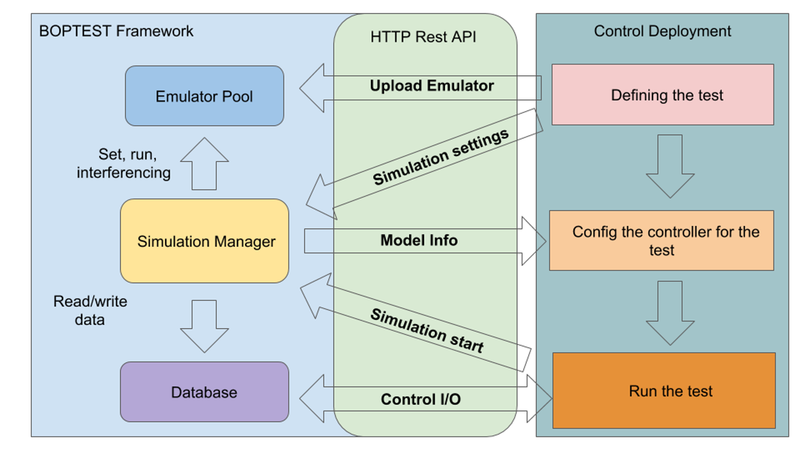
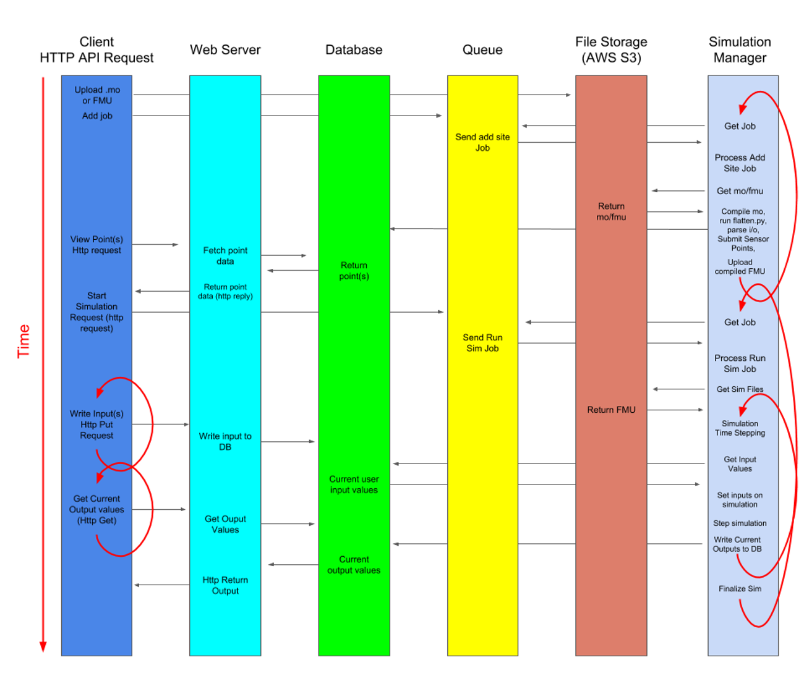

.. _SecArch:

Run-Time Platform Architecture
==============================

Existing Components
-------------------

The BOPTEST software architecture draws upon multiple separate development
efforts that predate the current combined project team composed of LBNL,
PNNL, and NREL. Each participating laboratory brings complementary components
that will be folded into the shared architecture that is described in
this section.

LBNL developed a prototype of the BOPTEST HTTP web server that provides a
REST style API which allows clients to interact with an FMU based simulation
through HTTP requests. This work is contained in a GitHub repository located
here https://github.com/ibpsa/project1-boptest.

PNNL implemented two rule-based control logic sequences and developed one
optimization based controller, for a typical variable air volume system
(https://www.ashrae.org/File%20Library/Conferences/Specialty%20Conferences/2018%20Building%20Performance%20Analysis%20Conference%20and%20SimBuild/Papers/C101.pdf).
Those rule-based control logic sequences are representative for field implementations and considered as
“baseline controllers”. The optimization based controller can
benchmark the performance of advanced control algorithms such as model
predictive control. PNNL also developed a high fidelity building emulator
for a large office building, which couples the envelope model with EnergyPlus
and the system model with Modelica. PNNL evaluated both baseline controllers
and the optimization based controller with the large office building
emulator. To facilitate the evaluation, PNNL developed an interface, based
on a socket connection that enables the interactions between the supervisory
controller with the building emulator. The large office building emulator,
the baseline controllers, and the optimization based control prototypes can
be leveraged during the development of the BOPTEST framework. Specifically,
the integration of this high fidelity emulator with an optimization based
controller embodies the data exchange and functionality desired by a control
developer and could serve as a test case for the BOPTEST architecture.
The REST API developed by LBNL will replace the socket based interface in
providing the interaction between the building emulator and the developed
controllers.

NREL developed a web service called Alfalfa that enables clients to interact
with EnergyPlus simulations using HTTP requests based on the Project Haystack
standard. The capabilities of the REST API are similar to the BOPTEST design
but, the specific conventions are different in order to fit into the Haystack
specification. The Alfalfa source code is also hosted on GitHub here
https://github.com/NREL/alfalfa, and the software is deployed to Amazon Web
Services and can be accessed by clients at this url: http://alfalfastack.net

Target Architecture
-------------------
The target architecture is one that combines the FMU simulation capabilities
of LBNL’s BOPTEST prototype with NREL’s software as a service oriented design
of Alfalfa. The finished product should also be compatible with advanced
controllers (clients) developed by PNNL.

The desired architecture is similar in function to the BOPTEST prototype, but
with aspects of the Alfalfa architecture incorporated. Specifically the
intention is to incorporate Alfalfa’s design as a software service supporting
multiple simultaneous simulations with potentially multiple controllers
(clients) interacting with the service at the same time, and even multiple
controllers interacting with a single simulation at the same time.

The BOPTEST prototype resides within a single process serving both functions
of the web service and the (FMU based) simulation manager. Alfalfa is a more
complicated design with separate processes for the web service and the
(EnergyPlus based) simulation manager. In Alfalfa, since the web service and
the simulation manager are decoupled there is a database component
interacting between the two pieces. In this way Alfalfa can serve multiple
HTTP requests at a high rate, while also scaling up and down the number of
simulations without impacting the web service. Future iterations of the
software may also utilize the database to provide the functions of a
historian to retrieve previous timestamp values.

The major pieces of the target architecture are outlined by the following figure.

    Workflow diagram.

The major components of the architecture are the following:

1. HTTP Web Server
	The web server is the controller client’s main point of interaction.
	A client can perform the following actions by interacting with the
	web server.

	- Add a new simulation test case via a file upload facilitated by the web server, or choose a simulation test case from a pre populated list of available models.

	- Start a simulation and advance time.

	- Read simulation outputs.

	- Set simulation inputs.

2. Database
	The database is responsible for storing metadata pertaining to all of
	the control points, in addition to the current values of all control
	points.

	- If a control point is writable as an input or actuator, then the database will store the most current value requested by the controller client. The simulation manager will look to the database for the input value at each simulation timestep and apply the current value to the simulation.

	- If a control point is a simulation output or sensor, the database will store at minimum the current value provided by the simulation via the simulation manager component. If a client requests the current value of an output, the web server will fulfill the request by retrieving the current value from the database.

	- The database is not exposed to the client, but rather accessed via the facilities of the HTTP server.

3. File Storage
	Clients are to have the ability to upload their own FMU based models
	to the BOPTEST service. A bulk file storage component will be
	responsible warehousing the FMU models. A model upload may be
	facilitated by the web server component (such as providing a http
	upload web form), however the actual data transfer may happen directly
	to file storage component. For example the bulk file storage in
	Alfalfa is handled by Amazon S3, which allows for direct HTTP based
	uploads, thereby avoiding load on the primary HTTP web server component.

4. Queue
	The queue (not depicted graphically)  is used to facilitate multiple
	simulations at the same time. A message is added to the queue when a
	simulation is requested, containing at minimum the model to simulate,
	as well as any required parameters about the simulation. Meanwhile
	the Simulation Manager while in the idle state will monitor the queue
	for available simulation jobs, and “pop” a job off the queue when one
	becomes available, then begin to process the simulation.

5. Simulation Manager
	A simulation is carried out by the Simulation Manager. This component
	monitors the Queue for a simulation job. When a job is available the
	simulation manager identifies the appropriate model based on the
	message payload received from the Queue, and then begins a simulation.
	The Simulation Manager communicates with the database at each
	simulation timestep by writing current output values to the database,
	and reading current input values that may have been set by the
	client and applying them to the simulation.

Software Communication in Time
------------------------------

Another way to visualize the software architecture is using a swim diagram,
which is a two dimensional view of the software components and the data
transfer between them. In this view time advances down the vertical axis,
and communication between components at a moment in time is shown
horizontally. In this way it is possible to view the data flow within the
software architecture from the moment a new model is provided to BOPTEST,
through the completion of a simulation and test.

    Swim diagram.

Concrete examples of portions of this architecture exist in the BOPTEST and
Alfalfa repositories. Specific references are identified here, and will drawn
upon to develop the target architecture.

1. HTTP Web Server
	BOPTEST and Alfalfa both contain a web server component.
	The target architecture will merge elements of both of these.
	- https://github.com/NREL/alfalfa/tree/master/web/server
	- https://github.com/ibpsa/project1-boptest/blob/master/restapi.py

2. Simulation Manager
	As noted, Alfalfa has an EnergyPlus based Simulation Manager. It
	demonstrates coordination between the simulation and database, however
	it does not simulate FMUs. Here again the objective is to combine
	elements of both.

	- https://github.com/NREL/alfalfa/blob/master/worker/runsimulation/runSimulation.py

	- https://github.com/ibpsa/project1-boptest/blob/master/examples/twoday-p.py

3. Database, Queue, File Storage
	These components can be supported by off the shelf software.
	They are defined in Alfalfa via Docker images, identified and linked
	together through a docker “compose” file.

	- https://github.com/NREL/alfalfa/blob/master/docker-compose.yml

Deployment Notes
----------------

The target software architecture is designed to support a software as a
service that scales with increasing load is deployable to services such as
Amazon Web Services, however it is also necessary to support local deployment
on a PC. Local deployments should be done without any communication outside
of the local area network. In order to meet these requirements a Docker based
workflow will be adopted, with each component contained without its own
container. This workflow is described in more detail in the Alfalfa README
doc. https://github.com/NREL/alfalfa/blob/master/README.md
