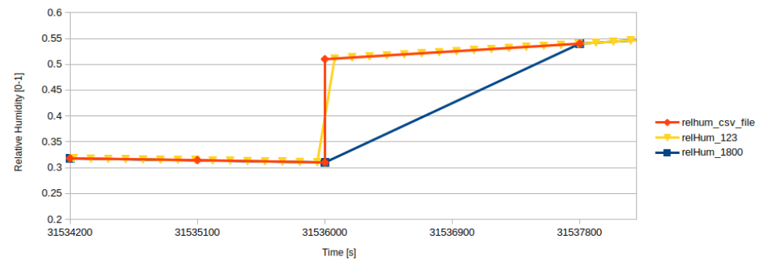

.. _SecForGen:

Forecast Generation
===================

Forecaster Module
-----------------

A forecaster module is developed to retrieve forecast from a BOPTEST
testcase, which is needed for predictive controllers. This module uses the
:code:`data_manager` object of a test case to read the deterministic forecast from
the testcase :code:`wrapped.fmu`.  As described below, a forecast uncertainty emulator
allows a user to optionally add uncertainty to weather forecasts for
dry bulb temperature and global horizontal irradiation.
Without uncertainty, the controller developer can choose the prediction horizon and interval of
the forecast from the actual simulation time. The controller developer may
also filter the forecast for a specific data category or request all data
variables and filter it afterwards.  Forecasts with uncertainty, however,
are limited in their allowable horizon and interval in order to stay consistent
with underlying uncertainty models.

Getting Weather Forecasts Across Year-End
-----------------------------------------

The data in TMY weather files used in BOPTEST test cases are discontinuous
at the end of the year relative to the start of the year.
Therefore, so is the weather data in the .csv files supplied for weather
forecast generation.  As an example, see the relative humidity in the
figure below (orange line). If weather forecasts are asked for that cross
year-end, the :code:`data_manager` object used by the forcaster module splits the
data at year-end into one portion that is inclusive of the last data point
at the end of the year (midnight), and one portion after the end of the
year that is not inclusive of the first data point at the start of the
year (midnight). The implementation is done this way so that the forecast
is more consistent for any interval through the full first year if a user
only intends to simulate one year. The relative humidity plot below shows
the interpolation behavior of the implementation graphically for forecast
intervals of 1800s and 123s (intervals used in the unit tests), compared
to the reference weather boundary condition data at 1800s intervals
in the .csv file.

    Forecast retrieved across one year for intervals of 1800s (blue) and
    123s (yellow) compared to the reference data in the boundary condition
    .csv file (orange), shown for relative humidity.

Weather Forecast Uncertainty Emulator
-------------------------------------

The **weather forecast uncertainty emulator** adds stochasticity to the
deterministic forecasts in BOPTEST to better simulate real-world forecast
behavior. This module supports the development and evaluation of advanced
control strategies that rely on realistic representations of forecast
uncertainty.  While an overview is provided here, more details on the
underlying uncertainty model development and validation can be found
in Zheng et al. (2025).

Weather Forecast Uncertainty Model Development
~~~~~~~~~~~~~~~~~~~~~~~~~~~~~~~~~~~~~~~~~~~~~~

The emulator models uncertainty in forecasts of
**dry-bulb temperature** (ambient temperature) and
**global horizontal irradiation (GHI)** using a
**first-order autoregressive model (AR(1))**. The model was trained
using historical forecast and measurement data from four locations
with varying climates and forecast sources: *Berkeley*, *Berlin*,
*Oslo*, and *Leuven*. Forecast errors were calculated over a
48-hour prediction horizon at one-hour intervals.

**Dry-Bulb Forecast Uncertainty Model**

The forecast error for ambient temperature is modeled using a first-order
autoregressive process AR(1):

.. math::

   e_{\tau+1|k} = \phi \cdot e_{\tau|k} + \varepsilon_{\tau}, \quad \varepsilon_{\tau} \sim \mathcal{N}(\mu, \sigma^2)

The synthetic forecast is computed by adding the forecast error to the measured value:

.. math::

   \hat{X}_{\tau|k} = X_{k+\tau} + e_{\tau|k}

Where:

- :math:`\phi` is the autoregressive coefficient.
- :math:`\mu` and :math:`\sigma` are the mean and standard deviation of the residual noise.
- :math:`X_{k+\tau}` is the measured value at timestep :math:`k + \tau`.
- :math:`\tau \in [1, 48]` is the forecast horizon in hours.

The initial error is generated separately as:

.. math::

   e_1 = \phi_0 + \kappa_0 \cdot \omega_0, \quad \omega_0 \sim \mathcal{N}(0, 1)

**GHI Forecast Uncertainty Model**

The forecast error for global horizontal irradiation (GHI) uses the same AR(1) structure,
but with Laplace-distributed residuals to better match the peaked and heavy-tailed
nature of the real GHI forecast errors:

.. math::

   e_{\tau+1|k} = \phi \cdot e_{\tau|k} + \varepsilon_{\tau}, \quad \varepsilon_{\tau} \sim \text{Laplace}(u, b)

The synthetic GHI forecast is similarly constructed:

.. math::

   \hat{X}_{\tau|k} = X_{k+\tau} + e_{\tau|k}

Special handling is applied to GHI data:

- **Nighttime conditions**: When the measured GHI is zero, no error is added (:math:`\hat{X}_{\tau|k} = 0`).
- **Post-processing**: A moving average filter with a 3-sample window is applied
to smooth synthetic GHI forecasts and reduce unrealistic high-frequency noise.

The model calibration process, including error extraction, statistical analysis,
and model fitting, was performed separately from the BOPTEST framework within Zheng et al. (2025).
The resulting model parameters (AR coefficients and distribution properties)
are the only components carried forward into BOPTEST.

Weather Forecast Uncertainty Scenarios Definition
~~~~~~~~~~~~~~~~~~~~~~~~~~~~~~~~~~~~~~~~~~~~~~~~~

BOPTEST supports four different uncertainty scenarios:

1. **Deterministic** (no uncertainty included in the forecasts).
2. **Low uncertainty**.
3. **Medium uncertainty**.
4. **High uncertainty**.

Each uncertainty scenario corresponds to a predefined set of AR(1)
model parameters. These include the autoregressive coefficient (F),
gain on the noise term (K), and the mean of the noise distribution (μ).
An initial error condition is also defined using F₀ and K₀.

For GHI, the parameters are derived directly from the behavior observed at
three cities analyzed in Zheng et al. (2025) (Berkeley, Leuven, and Berlin).
Each city dataset was mapped to one of the scenarios based on the
observed error distributions.

For ambient temperature, the scenario parameters were not taken from a
single site, but rather derived through a combination and aggregation of
data across five locations (Berkeley, Leuven, Berlin, Oslo, and Milan).
This allowed for a broader representation of forecast variability.
The statistical targets, mean error and standard deviation evolution
over the forecast horizon, were established based on real data, and an
optimization routine was used to calibrate the AR(1) model parameters
accordingly. These models were tuned to approximate real-world behaviors
such as variance growth over time and location-specific biases.
For example, the high uncertainty scenario includes a nonzero mean to
reflect systematic bias observed in some forecast datasets.

Configuration of Uncertainty in BOPTEST by Users
~~~~~~~~~~~~~~~~~~~~~~~~~~~~~~~~~~~~~~~~~~~~~~~~

The forecast uncertainty can be configured by users in the following ways:

- **Whether uncertainty is enabled**: Users can choose whether they want deterministic or stochastic forecasts.
- **Which forecast variables are affected**: Uncertainty may be applied to ambient temperature, global horizontal irradiation (GHI), or both.
- **The uncertainty scenario**: Forecasts may follow low, medium, or high uncertainty levels, representing varying degrees of forecast error.
- **The seed for randomization**: Users can define a fixed seed value to ensure reproducibility of stochastic forecast realizations across simulation runs.

Users use the BOPTEST API to configure forecast uncertainty. Specifically, scenario parameters
are available in the :code:`/scenario` request for :code:`temperature_uncertainty` and :code:`solar_uncertainty`,
which can each take values of :code:`None` (default), for deterministic, or :code:`low`, :code:`medium`, or :code:`high` if a user wants to enable uncertainty.
A user can also define a :code:`seed` parameter with any integer value, which allows for repeatable results of the
underlying random processes, and therefore, sequence of uncertain forecasts for a given test set up.

When obtaining forecasts with the :code:`/forecast` request, if a scenario with uncertainty has been
configured, and the forecast request includes ambient temperature (:code:`TDryBul`) or GHI (:code:`HGloHor`),
the :code:`horizon` parameter is limited to less-than-or-equal to 48 hours.  In addition, the forecast and
associated error with these variables will only be updated at the start of each hour of simulation time.
Use of the :code:`interval` parameter will interpolate the forecasts to the specified interval,
but for forecast variables with uncertainty, the interpolation will be linear based on an underlying
uncertain forecast with interval of one hour, consistent with the validation of the error models as described above.

Code Integration and Related Files
~~~~~~~~~~~~~~~~~~~~~~~~~~~~~~~~~~

The forecast uncertainty emulator is integrated into the BOPTEST framework
through the following core modules and configuration files:

- :code:`forecast/error_emulator.py`
This is the core module implementing the forecast uncertainty model
(previously referred to as uncertainty_emulator.py). It includes the AR(1)
model logic and error sampling functionality for temperature and GHI.

- :code:`forecast_uncertainty_params.json`
A JSON file storing the pre-calibrated parameters
(AR coefficients, noise distributions, etc.) for each uncertainty scenario.
This file is loaded and read-in by BOPTEST at runtime upon deployment.

- :code:`tests/test_forecast_uncertainty.py`
Contains specific unit tests for verifying emulator functionality.
Additional unit tests are also present in the API unit test module.

References
~~~~~~~~~~
Zheng, W., Zabala, L., Febres, J., Blum, D., & Wang, Z. (2025). Quantifying and simulating the weather forecast uncertainty for advanced building control. *Journal of Building Performance Simulation*, 1–16. https://doi.org/10.1080/19401493.2025.2453537.
