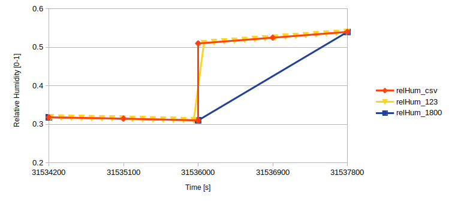

.. _SecForGen:

Forecast Generation
===================

Forecaster Module
-----------------

A forecaster module is developed to retrieve forecast from a BOPTEST
testcase, which is needed for predictive controllers. This module uses the
:code:`data_manager` object of a test case to read the deterministic forecast from
the testcase :code:`wrapped.fmu`. In future developments it will be possible to
request stochastic forecast with a predefined distribution over the
deterministic forecast for research purposes. This distribution will be
added on the top of the deterministic forecast mentioned before.

The controller developer can choose the prediction horizon and interval of
the forecast from the actual simulation time. The controller developer may
also filter the forecast for a specific data category or request all data
variables and filter it afterwards.

Getting Weather Forecasts Across Year-End
-----------------------------------------

The data in TMY weather files used in BOPTEST test cases are discontinuous
at the end of the year relative to the start of the year.
Therefore, so is the weather data in the .csv files supplied for weather
forecast generation.  As an example, see the relative humidity in the
figure below (orange line). If weather forecasts are asked for that cross
year-end, the :code:`data_manager` object used by the forcaster module splits the
data at year-end into one portion that is inclusive of the last data point
at the end of the year (midnight), and one portion after the end of the
year that is not inclusive of the first data point at the start of the
year (midnight). The implementation is done this way so that the forecast
is more consistent for any interval through the full first year if a user
only intends to simulate one year. The relative humidity plot below shows
the interpolation behavior of the implementation graphically for forecast
intervals of 1800s and 123s (intervals used in the unit tests), compared
to the reference weather boundary condition data at 1800s intervals
in the .csv file.

    Forecast retrieved across one year for intervals of 1800s (blue) and
    123s (yellow) compared to the reference data in the boundary condition
    .csv file (orange), shown for relative humidity.
