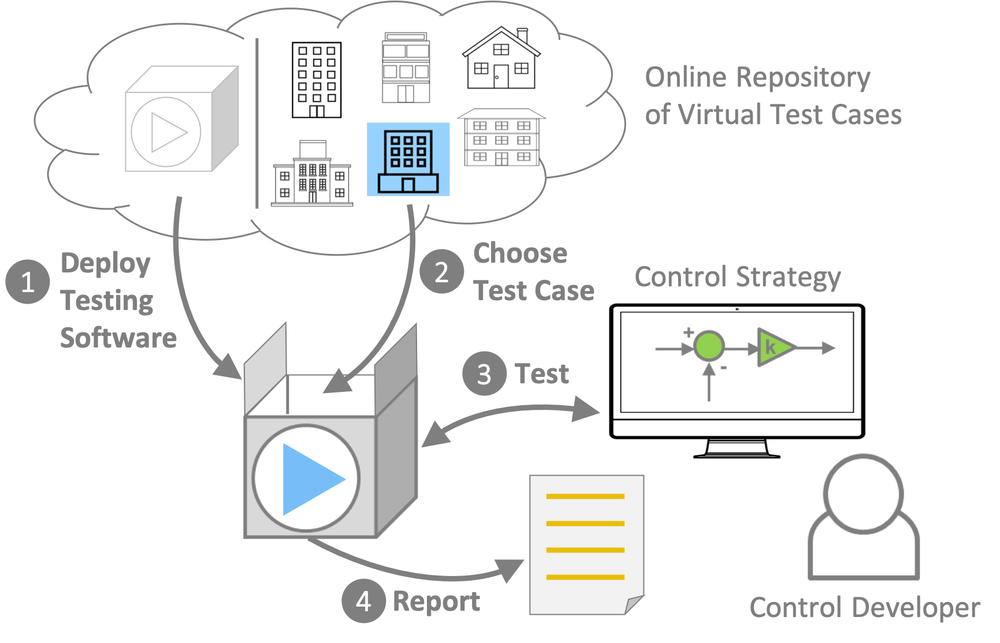

.. _SecGoal:

Goal
====

The goal of BOPTEST is to enable simulation-based testing and benchmarking of
advanced control strategies in buildings for researchers and industry.
This will occur through the development of:

1. Reference building emulation test cases that are available to all users.

2. Key performance indicators (KPI) that assess the performance of a control strategy.

3. Software platform to select and manage test cases, handle control and measurement data exchange between the user’s control software and the building emulation, calculate KPIs, and generate reports.

4. Procedures for benchmarking and user guide for controls development testing.

Figure 1 illustrates this goal:

    BOPTEST concept.
