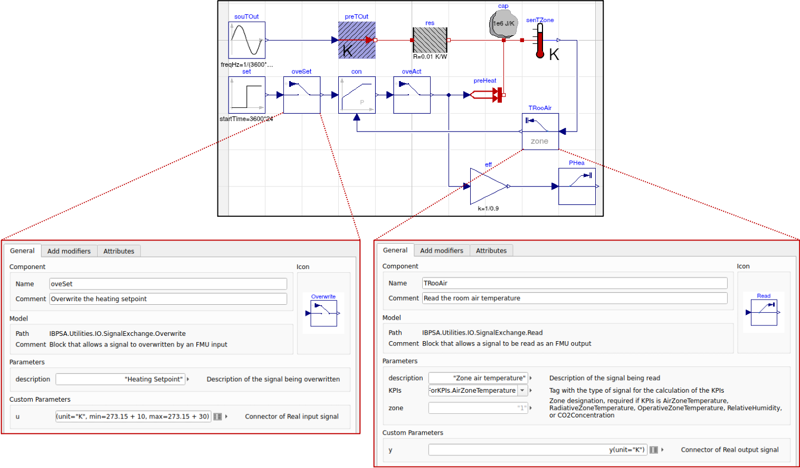
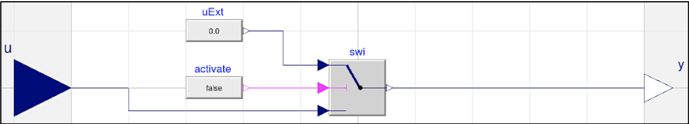
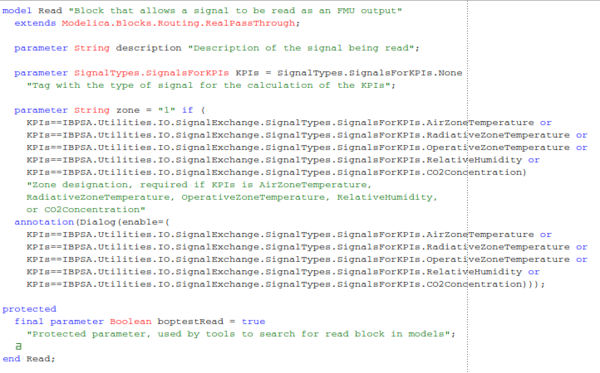
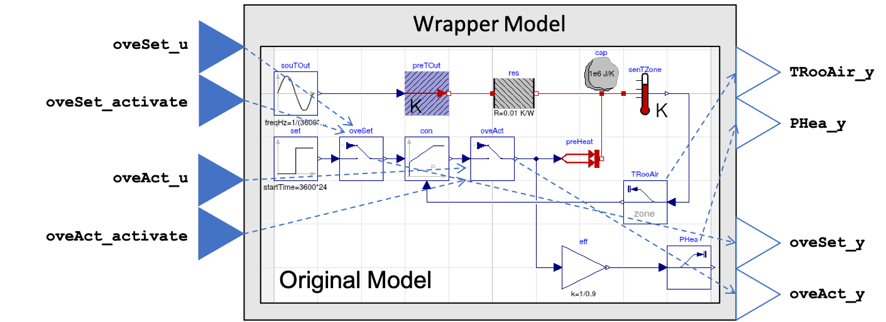

.. _SecTestCaseDev:

Reference Test Case Development
===============================

This section outlines the development requirements of a reference test case.
A reference test case consists of the following components:

1. Modelica model

	- Include documentation html in .mo file
	- The model should include the “uses” Modelica annotation to specify
	  the names and versions of additional Modelica libraries on which it depends.

2. FMU

	- Include boundary condition data in resources folder (this is: weather data, occupancy
	  schedules, energy pricing, emission factors, internal gains and
	  comfort set-points).
	- Include additional API configuration jsons in resources folder (this is: kpis.json, days.json, config.json)
	- Generated without run-time license restrictions.
	- Generated as co-simulation.
	- Generated for Ubuntu 20.04 x86.
	- Template scripts will be developed to help the model developer
	  generate the test case FMU.

3. Documentation

4. BACnet object definition file (optional: for use with BACnet interface)

Test Case Repository
--------------------

Each test case will be stored and maintained in a repository under the IBPSA
github account with an appropriate name.  The repository will have the
following structure:

::

	TestCaseName			// Test case directory name
	|--model			// Model directory
	|  |--Resources			// Resources directory with test case data
	|  |--model.mo 			// Modelica model file
	|  |--model.fmu 		// BOPTEST ready FMU
	|  |  |--resources 		// Resources directory
	|  |  |  |--kpis.json 		// JSON mapping outputs to KPI calculations
	|  |  |  |--days.json 		// JSON mapping time period names to day number for simulation
	|  |  |  |--config.json 	// BOPTEST configuration file and sets defaults
	|  |  |  |--weather.mos 	// Weather data for model simulation in Modelica
	|  |  |  |--weather.csv 	// Weather data for forecasting
	|  |  |  |--occupancy.csv 	// Occupancy schedules
	|  |  |  |--internalGains.csv 	// Internal gain schedules
	|  |  |  |--prices.csv 		// Energy pricing schedules
	|  |  |  |--emissions.csv 	// Energy emission factor schedules
	|  |  |  |--setpoints.csv 	// Thermal  and IAQ comfort region schedules
	|  |--bacnet.ttl        	// BACnet object definition file
	|--doc				// Documentation directory
	|  |--doc.html 			// Copy of .mo file documentation
	|  |--images 			// Image directory
	|  |  |--image1.png 		// Image for model documentation

Control and Sensor Signal Exchange in Modelica
----------------------------------------------
This section describes the exchange of signals to occur in the Modelica
emulator model.  Two types of signals are to be exchanged: control input
signals and measurement output signals.  To facilitate the exchange of these
signals with external entities, ease the implementation of such exchange by
avoiding passing of inputs and outputs to top-level models, and facilitate the
calculation of KPIs as described in later sections, two Modelica blocks will
be added to the Modelica IBPSA Library that can be used to 1) overwrite
signals in the model from an external interface and 2) sample signals from
the model to an external interface.  The blocks have been implemented in the
Modelica IBPSA Library in the package :code:`IBPSA.Utilities.IO.SignalExchange` and
are called :code:`Overwrite` and :code:`Read` respectively.  These blocks are added to an
emulation model and used in combination with a parser script to identify the
signals to be exchanged, propagate them as inputs/outputs to a top-level
model, and export this top-level model as an FMU.  In this way, the BOPTEST
run-time architecture (See Section VI) can be designed around the simulation
of generic FMUs, while the ability to overwrite and read any signal within
the model is preserved. The Figure below shows an example implementation of
the blocks in a model.

    Example placement and configuration of signal exchange blocks for single RC zone model with
    heater and proportional feedback control.  Signal exchange blocks are used
    for supervisory set point overwrite (:code:`oveSet`),
    local loop actuator overwrite (:code:`oveAct`),
    zone temperature measurement (:code:`TRooAir`),
    and heating power measurement (:code:`PHea`).
    Signal exchange blocks may be implemented at any hierarchical level of a model.

**Control Signal Overwrite**

The emulator developer will determine the exact control signals to allow for
overwriting by an external interface, however, must include at least all
actuator control signals.  This allows for use of any advanced control system.
To the emulator developers discretion, local loop controllers may be included
in the model which are deemed representative of the case being emulated.
The setpoints of these local loop controllers may also be subject to control
signal overwrite, instead of their corresponding actuator signals.  The
Overwrite block is constructed as shown in the image below and also contains
a protected parameter “boptestOverwrite.”

    Modelica construction of Overwrite signal exchange block.

**Sensor Signal Reading**

The emulator developer will add read blocks to post signals to the external
interface at their discretion to provide measurements from sensors in the
building that are representative of the case being emulated.  The Read block
is constructed with an input and output signal with a protected parameter
named “boptestRead.”  The parameter :code:`KPIs` allows for tagging the specific
signal to be used in KPI calculations.  The conditional parameter :code:`zone`
allows for designating a zone associated with the particular KPI tag if needed.

    Modelica construction of Read signal exchange block.

**Parsing and FMU Export**

The parser in :code:`parsing/parser.py` has two main functions, which each have a number of steps.
The concept is presented in the Figure below.  The first function is to
identify the blocks in the model:

1. Export the original model containing the signal exchange blocks into an FMU

2. Search for all instances of the parameters :code:`boptestOverwrite` and :code:`boptestRead`

3. Record the paths of each block instance, and also store information such as signal units, descriptions, min/max, zone designation, and other signal attribute data.

The second function is to export a wrapper FMU that utilizes the signal exchange blocks:

1. Create a new top-level model (called wrapper.mo).

2. Instantiate an instance of the original model.

3. Add two inputs for every Overwrite block found named :code:`<block_instance_path>_u` and :code:`<block_instance_path>_activate`.  Assign :code:`<block_instance_path>_u` the unit, descriptions, min/max,  and other signal attribute data specified by the Overwrite block.  Also add one output for every Overwrite block found name :code:`<block_instance_path>_y`.  Assign :code:`<block_instance_path>_y` the unit, descriptions, min/max,  and other signal attribute data specified by the Overwrite block.

4. Add one output for every Read block found named :code:`<block_instance_path>_y`.  Assign :code:`<block_instance_path>_y` the unit, descriptions, min/max, and other signal attribute data specified by the Read block.

5. For Overwrite blocks, connect :code:`<block_instance_path>_u` to :code:`<block.instance.path>.uExt.y`, :code:`<block_instance_path>_activate` to :code:`<block.instance.path>.activate.y`, and :code:`<block_instance_path>_y` to :code:`<block.instance.path>.y`.

6. For Read blocks, connect :code:`<block_insance_path>_y` to :code:`<block.instance.path>.y`.

7. Export the resulting wrapper.mo as an FMU to wrapper.fmu.

An external interface may use the control signal inputs (:code:`_u`) to send control
signals to specific overwrite blocks, activation signal inputs (:code:`_activate`) to
enable and disable signal overwriting, and signal outputs (:code:`_y`) to measure
specific variables within the model.  Note that the outputs added
corresponding to the Overwrite blocks may be used to retrieve the "current value"
of a control signal.  By default, the activation of the signal
overwrite block is set to False.  In this way, external interfaces need to
only define control signals for those that are being overwritten.

    Concept of signal exchange block utilization.  A parser script parses the
    original model to find all instances of the signal exchange blocks and
    then creates a wrapper model that exposes the available control signal value inputs
    (e.g. :code:`oveSet_u`), control signal activation inputs (e.g. :code:`oveSet_activate`),
    control signal current value outputs (e.g. :code:`oveSet_y`),
    and measurment sensor outputs (e.g. :code:`TRooAir_y`)
    of the signal exchange blocks using a standard FMU interface.

KPI Tagging and JSON Mapping
----------------------------

In order to facilitate the calculation of KPIs, a map needs to be created that
identifies which model outputs are to be included in the calculation of KPIs.
This map will take the form of a JSON saved as :code:`kpis.json` and with
the structure:

::

	{<kpi_ID> :		// Unique identifier for KPI
		[<output_ID>]	// List of FMU outputs to be included in calculation
	}

Here, the kpi_ID is a unique identifier that is used by specific
KPI calculations.  For example, “power” may be used to calculate energy
consumption, operating cost, and emissions.  For kpi_IDs requiring zone
designations, the zone designation can be appended to the end of the kpi_ID as
:code:`<kpi_ID>[z]`, where :code:`z` is the zone designation.
The output_ID is the name of the output variable in the model FMU.

This KPI JSON may be created manually by the model developer.  Alternatively,
functionality of the signal exchange blocks and parser described in the
previous section will facilitate the generation of the KPI JSON.
An enumeration parameter is added to the signal exchange Read block that takes
one kpi_ID that is to be associated with the specified output.  Additionally,
a zone designation parameter is added to the signal exchange Read block, which
should be used to specify the zone designation for particular kpi_IDs.
The parser reads the parameters for each output specified by the Read block,
builds the KPI JSON accordingly, and exports it along with the wrapper FMU.
The list of available kpi_ID is defined in
:code:`IBPSA.Utilities.IO.SignalExchange.SignalTypes` and is as follows:

.. csv-table:: Available KPI Tags
   :file: tables/kpi_ids.csv
   :header-rows: 1

In order to calculate the core KPIs defined in Section V. A., a minimum set
of kpi_ID shall be specified with corresponding measurement output(s).
This minimum set is as follows:

1. At least one of :code:`AirZoneTemperature[z]` or :code:`OperativeZoneTemperature[z]`

AND

2. At least one of :code:`ElectricPower`, :code:`DistrictHeatingPower`, :code:`GasPower`, :code:`BiomassPower`, or :code:`SolarThermalPower`

AND

3. :code:`CO2Concentration[z]`

Time Period Specification and JSON Mapping
------------------------------------------
In order to associate a time period scenario name with a concrete simulation
time, a map needs to be created that defines the day number in the year
around which the time period is based.  This map takes the form of a JSON saved
as :code:`days.json` with structure:

::

	{
	<time_period_ID> :    // Unique identifier for specifying time period
        	 <day_number>    // Integer value indicating day number to use for specifying time period
	}

Currently available time periods are defined as two-week test periods with
one-week warmup period utilizing baseline control.  The two-week period is
centered on the day defined by the day # in days.json.

Test Case Configuration and JSON Mapping
-----------------------------------------
In order to assign particular configuration and default values
for a test case upon loading in BOPTEST, a configuration JSON saved as
:code:`config.json` will have the structure:

::

    {
    "name"          : <str>,                         // Name of test case
    "area"          : <float>,                       // Floor area in m^2 to be used for KPI calculation
    "start_time"    : <float>,                       // Default start time
    "warmup_period" : <float>,                       // Default warmup_period
    "step"          : <float>,                       // Default control step in seconds
    "resource_file_exclusion" : [<str>]              // Optional: List of data files within fmu /resources directory to exclude from loading into test case (e.g. "filename.csv")
    }

BACnet Object Configuration and .ttl Mapping
--------------------------------------------
In order to enable a BACnet interface to read and write to BOPTEST points, a
:code:`bacnet.ttl` file is used to configure assignment of a BACnet object for each point
to a single BACnet device.  The file should be placed in the testcase :code:`models` directory
and have the following template structure:

::

    @prefix bldg: <urn:example#> .
    @prefix brick: <https://brickschema.org/schema/Brick#> .
    @prefix bacnet: <http://data.ashrae.org/bacnet/2020#> .
    @prefix unit: <http://qudt.org/vocab/unit/> .
    @prefix owl: <http://www.w3.org/2002/07/owl#> .
    @prefix ref: <https://brickschema.org/schema/Brick/ref#> .
    @prefix xsd: <http://www.w3.org/2001/XMLSchema#> .

    <urn:example#> a owl:Ontology ;
    	owl:imports <https://brickschema.org/schema/1.2/Brick#> .

    bldg:boptest-proxy-device a bacnet:BACnetDevice ;
    	bacnet:device-instance 599 .

    bldg:<boptest_point_name> a brick:Point ;
    	ref:hasExternalReference [
    		bacnet:object-identifier "analog-input,n" ;
    		bacnet:object-type "analog-input" ;
    		bacnet:object-name "<boptest_point_name>" ;
    		bacnet:objectOf bldg:boptest-proxy-device
    	] .

    # ... Repeat for each BOPTEST measurement point 1:n and replace <boptest_point_name> with the BOPTEST point name.

    bldg:<boptest_point_name> a brick:Point ;
    	ref:hasExternalReference [
    		bacnet:object-identifier "analog-output,m" ;
    		bacnet:object-type "analog-output" ;
    		bacnet:object-name "<boptest_point_name>" ;
    		bacnet:objectOf bldg:boptest-proxy-device
    	] .

    # ... Repeat for each BOPTEST input point 1:m and replace <boptest_point_name> with the BOPTEST point name. Only needed for inputs ending with _u and not _activate.

The file can be created automatically using the script
:code: `bacnet/create_ttl.py` located in the IBPSA github repository.

Data Generation and Collection Module
-------------------------------------

A Python module will be written to handle boundary condition data for the test
case.  The module will:

1. Have a method to combine all boundary condition data CSV files into resources folder of model FMU.  This method would be called by the Parser to add boundary condition data to the resulting FMU.

2. Have a method to find and return data associated with a specified variable name amongst the boundary condition data files within the resources folder of the model FMU.  This method would be called by the KPI Calculator and Forecast modules.

3. Have a method to generate a second weather file to be used for system identification if needed by an MPC controller.

The boundary condition data of a test case consists of several variables that
are grouped in different categories. The names and grouping of these variables
follow a convention established at the file “data/categories.json” of the
BOPTEST repository. This convention is also illustrated in the following
tables, which are used in the requirements of the CSV file formats, described
later in this section:

.. csv-table:: Category: Weather
   :file: tables/weather.csv
   :header-rows: 1

.. csv-table:: Category: Prices
   :file: tables/prices.csv
   :header-rows: 1

.. csv-table:: Category: Emissions
   :file: tables/emissions.csv
   :header-rows: 1

.. csv-table:: Category: Occupancy
   :file: tables/occupancy.csv
   :header-rows: 1

.. csv-table:: Category: Internal Gains
   :file: tables/internal_gains.csv
   :header-rows: 1

.. csv-table:: Category: Setpoints
   :file: tables/setpoints.csv
   :header-rows: 1

The NAME column in the tables indicates the key-words of the convention,
i.e., words with specific spelling that are used by the test case to identify
the type of data. Each of the variables should be representative of the test
case location and type of building.

The CSV data files containing the data should be located in the
“models/Resources” directory for processing and saving when exporting the
test case FMU. The processed test case data will be finally stored within
the “resources” directory of the test case FMU wrapped.fmu.

The CSV data files should accomplish the following requirements:

1. The files can have any name and can be located in any subfolder within the “models/Resources” directory of the test case.

2. The files should have a “time” column indicating the time since the beginning of the year in seconds.

3. The files should have column names using the key-words specified by the convention above.  Columns that do not apply to the test case may be omitted (e.g. :code:`EmissionsGasPower` if the test case does not use gas power).

4. The files can have optional header rows for holding information about the
data contained in the csv file.  These header rows can be indicated by starting
the row with the character "#".

Two python modules are developed to generate and handle the data,
these are the Data_Generator and the Data_Manager modules, respectively.

The Data_Generator module is meant to help the test case developer to generate
the test case data according the conventions specified above. The final goal
of this module is to generate and introduce the csv data files within the
“Resources” folder of the test case in order to import these data later
within the wrapped.fmu upon calling the Parser. Therefore, the use of this
module takes place before the parsing process. The test case developer is
strongly encouraged to use this module or at least follow it as a guideline
when generating the test case data. However, the csv data files can come
from any other source as far as they comply with the three requirements
mentioned above. In order to assist the test case developer in the generation
of the data sets, the Data_Generator module contains several methods to
generate the test case data grouped by categories and covering most of the
common signal shapes which can still be tuned using certain arguments.

Special mention should be made to the generate_weather method of the
Data_Generator module. This method reads the data from a file using the
Typical Meteorological Year (TMY3) format and applies the transformation
carried out by the ReaderTMY3 model of the IBPSA library that is already
integrated and used by other Modelica libraries like Buildings. The final
outcome is a weather bus with the keys specified at the weather category
table. The generate_prices method generates three electricity price profiles
corresponding to each of the three test case scenarios,
i.e., PriceElectricPowerConstant, PriceElectricPowerDynamic and
PriceElectricPowerHighlyDynamic. The first one is a completely constant
price profile throughout the year. The second one corresponds to a day-night
tariff, meaning that the electricity price varies between two values depending
on whether it is day or night time. Finally, the third one is a continuously
varying price profile representing a more dynamic market. The generate_prices
method also generates price profiles for the other energy sources, i.e., gas,
district heating, biomass and solar thermal. In a similar way, the
generate_emissions method of the Data_Generator module generates profiles for
the emission factors of each of the possible energy sources. However, for the
emission factors only one profile is generated per energy source, the
electricity prices is the only case that considers multiple scenarios.
Finally, the occupancy, internal gains and comfort temperature ranges are
generated per zone ‘z’. The test case developer may need to adapt the
parameters of these data generation methods to correspond with the type of
building and the location of the test case emulation model.

Once the data is generated, the Data_Manager is the module that provides the
functionality to introduce and retrieve the data into and from the test case
FMU. The functionality of introducing the data into the FMU is normally
employed by the Parser module. In this case, the Data_Manager goes through
the CSV data files located at the “models/Resources” folder looking for
columns with the names established in the categories.json file that captures
the data key-words convention. The files that contain any column following
the convention are introduced within the “resources” folder of the FMU after
trimming any other variable that does not follow the convention.

On the other hand, the functionality of retrieving the data is used by the
Forecaster and KPI_Calculator modules. During the initialization of a
test case, the full test case data is loaded from the test case FMU into
the test case object. This happens only once to reduce the computational
load when getting the test case data. Once the full data is loaded, the
Data_Manager only slices for the period and variables requested to return
the necessary data. In the case of the Forecaster, the Data_Manager is
imported to access the test case data in order to provide deterministic
forecast. The final objective is to provide data that may be required to
enable any kind of predictive control. The KPI_Calculator module makes
use of the Data_Manager to access the boundary condition data during the
simulation period for KPI calculation. For example, the KPI_Calculator
requires electricity pricing to compute total operational cost, or emission
factors to compute the total amount of equivalent kilograms of CO2 released
during the simulation period.

Style Conventions
-----------------

Modelica code style conventions should follow the IBPSA style guide for
Modelica models at: https://github.com/ibpsa/modelica-ibpsa/wiki/Style-Guide

Documentation
-------------

Documentation should present the test case so that control developers
understand the system under control.  Figures and schematics are highly
encouraged to be presented as needed.  The following sections and subsections
should be included:

**Building Design and Use**
	- Architecture
	- Constructions
	- Occupancy schedules and comfort requirements
	- Internal loads and schedules
	- Climate
**HVAC System Design**
	- Primary and secondary system designs
	- Equipment specifications and performance maps
	- Rule-based or local-loop controllers (if included)
**Additional System Design**
	- Lighting
	- Shading
	- Onsite generation and storage
**Points List**
	- Control input signals, descriptions, and meta-data
	- Measurement output signals, descriptions, and meta-data
	- Forecast signals, descriptions, and meta-data
**Important Model Implementation Assumption**
	- (e.g. moist vs. dry air, airflow network, and infiltration models)
**Scenario Information**
	- Time Periods
	- Energy pricing
	- Emission factors

The documentation should be included within the Modelica model in HTML
format and also made available according to the Test Case Repository
structure.  The HTML template is as follows:

::

	<html>
	<h3>Section 1</h3>
	<h4>Subsection 1.1</h4>
	

	xxx
	

	<h4>Subsection 1.2</h4>
	

	xxx
	

	<h3>Section 2</h3>
	<h4>Subsection 2.1</h4>
	

	xxx
	

	<h4>Subsection 2.2</h4>
	

	xxx
	

	</html>

Peer Review Process
-------------------

The purpose of the peer review process is to ensure emulation models are
constructed well enough for use in control strategy testing.  The test case
developer is to assign a peer reviewer other than themselves to make checks
such as:

1. Check modelling conventions and verify documentation

	a. Verify units of inputs/outputs and implementation of KPIs

2. Model satisfies key physical aspects such as 1st and 2nd laws of thermodynamics and mass balance.

3. Reasonable modeling approaches for necessary physics (e.g. thermal mass).

4. Documentation is clear and comprehensive enough.

5. Model is representative

	a. Reasonable dimensions and equipment capacities (e.g. radiators should be able to satisfy the heat demand, but not too easily).

	b. Corresponds to the intended BOPTEST case

A review document template shall be developed to ensure all test case reviews
are done with similar quality.  The template shall be made available in a
public repository to all reference test case developers.  The model developer
should initiate completion of the review document and provide it to the model
reviewer, along with the test case.  The reviewer should complete the review
by checking all criteria outlined in the document are satisfied.  If they are
not, appropriate comments should be made in the review document.  The review
document should then be given back to the model developer, who should then
make corrections to the test case as specified by the comments.  Upon
completion, a second review may take place, and so on until all criteria
have been satisfied.

Unit Testing
------------

A testing scheme shall be implemented to ensure test case functionality is
maintained as code is developed and models are updated.  There are four
primary elements of the testing scheme:

1. Testing that the Modelica model can be compiled into the FMU used within the test case and that the kpis.json is consistent with a reference.

2. For each scenario, testing that the emulation model FMU gives results that are consistent with reference results generated by a reference controller.  These results include a) KPI values and b) trajectories of significant variables.

3. Testing that the test case is exercised and appropriately interacted with by the BOPTEST API and run-time platform.

4. Testing that API and simulation errors are handled appropriately.
