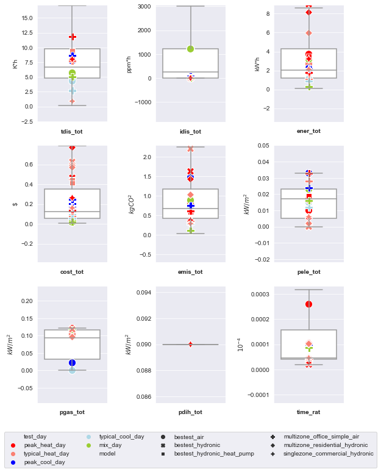

# Baseline Testing

This folder contains examples and results for performing testing of baseline controllers for different testcases.

## Baseline Controller and Test Case Implementation

- For each ``<TestCase>``, the baseline controller module file ``<TestCase>.py`` and the test script ``testcase<TestCase>scenario.py`` will be used for running an example baseline test.

- Baseline control modules files ``<TestCase>.py`` are located in ``../controllers``. The baseline controllers are actually incorporated in the testcase models.
The function ``compute_control`` is psuedo. The control inputs will not be overwritten by this external controller. Thus, baseline controllers in the testcase models will be used. 

- For test scripts ``testcase<TestCase>scenario.py`` for performing the baseline control test, user could specify the combination of
simulation start, warmup_period, and length or a predefined test case scenario. For the default setting of the baseline tests,
 scenarios with different electricity prices and time periods will be  simulated. 

## Run an Example Baseline Test
- First, deploy the test case corresponding to the desired example (see repository root ``README.md`` for instructions on deploying a test case).
- Then, use ``$ python testcase<TestCase>scenario.py`` to run the desired example.

## Baseline Testing Scenarios
Two-week simulation are conducted with three electricity price schemes and representative time periods for each testcase. Please see ``root/Testcases/README.md`` for different predefined scenarios for each testcase. 

For each scenario, one week simulation before ``time_period`` is conducted for the warm-up and two-week simulation is then conducted.
The results of these representative scenarios are also compared with the average results of one year/heating season (that depends on the testcases) with a rolling window of two weeks. 
In total 3180 scenarios are simulated for different testcases with various time periods and three electricity price schemes. 
However, it is noted that the baseline controls do not use price signal information, and therefore the KPI results are the same for scenarios with different electricity price schemes except the total cost and controller computational time ratio. 
For the KPIs including the cost and controller computational time ratio, we consider all 3180 scenarios. To avoid the repetition, we only show the baseline results of one electricity price scheme (in total 1060 cases as shown below) for rest of KPIs.

The purpose of showing the baseline testing results are to provide a reference range for different KPIs among different test cases with various time periods and three electricity price schemes. 
The high-level [statistical results for all the testcases](#summary-results-for-all-the-testcases)are summarized first. Then [the by-testcase results](#detailed-results-for-each-testcase) are individually illustrated for the following testcases:

1. [bestest_air](#1-bestest_air) (365-7-14=344 time periods)
2. [multizone_office_simple_air](#2-multizone_office_simple_air) (365-7-14=344 time periods)
3. [bestest_hydronic](#3-bestest_hydronic) (93 time periods)
4. [bestest_hydronic_heat_pump](#4-bestest_hydronic_heat_pump) (93 time periods)
5. [multizone_residential_hydronic](#5-multizone_residential_hydronic) (93 time periods)
6. [singlezone_commercial_hydronic](#6-singlezone_commercial_hydronic) (93 time periods)

## Summary results for all the testcases

The following table shows the statistics of the KPIs for all the testcases and the boxplot shows the distribution of different KPIs with the typical day results annotated. 
From there, one could benchmark some hard-to-judge KPIs using the baseline testing data from all the testcases. 
For example, the third quartile value for ``tdis_tot`` is 9.8 K*h.
The testing result beyond that value probably needs further attention (e.g., doublecheck the benchmark results within the testcase).

<h4 align="center"> Statistic Summary Table of All Scenarios </h4>

|       |   tdis_tot |   idis_tot |   ener_tot |   cost_tot |   emis_tot |   pele_tot |   pgas_tot |   pdih_tot |    time_rat |
|:------|-----------:|-----------:|-----------:|-----------:|-----------:|-----------:|-----------:|-----------:|------------:|
| unit  |        K*h |      ppm*h |       kW*h |       euro |      kgCO2 |     kW/m^2 |     kW/m^2 |     kW/m^2 |           1 |
| mean  |        8.8 |     1649.5 |       3.24 |      0.228 |       0.81 |      0.015 |      0.074 |       0.09 |    0.000122 |
| std   |        6.5 |     3101.9 |       2.99 |      0.231 |       0.54 |      0.01  |      0.044 |       0    |    0.000608 |
| min   |        0.2 |        0   |       0.1  |      0.009 |       0.03 |      0     |      0     |       0.08 |    2e-05    |
| 25%   |        4.8 |        0   |       1.19 |      0.054 |       0.42 |      0.005 |      0.033 |       0.09 |    4.2e-05  |
| 50%   |        6.7 |      263.9 |       2.05 |      0.122 |       0.67 |      0.017 |      0.093 |       0.09 |    4.6e-05  |
| 75%   |        9.8 |     1222.2 |       4.28 |      0.349 |       1.17 |      0.023 |      0.117 |       0.09 |    0.000158 |
| max   |       29.1 |    14853   |      12.42 |      0.942 |       2.25 |      0.033 |      0.121 |       0.09 |    0.011904 |

<h4 align="center">Boxplot of KPI Distribution for All Scenarios</h4>

  

## Detailed results for each testcase

For each testcase, the baseline testing results are visualized by a scatterplot and a boxplot to show the KPI ranges in different scenarios. 
The detailed results for each testcase could be referred to ``baseline_control.ipython``.
