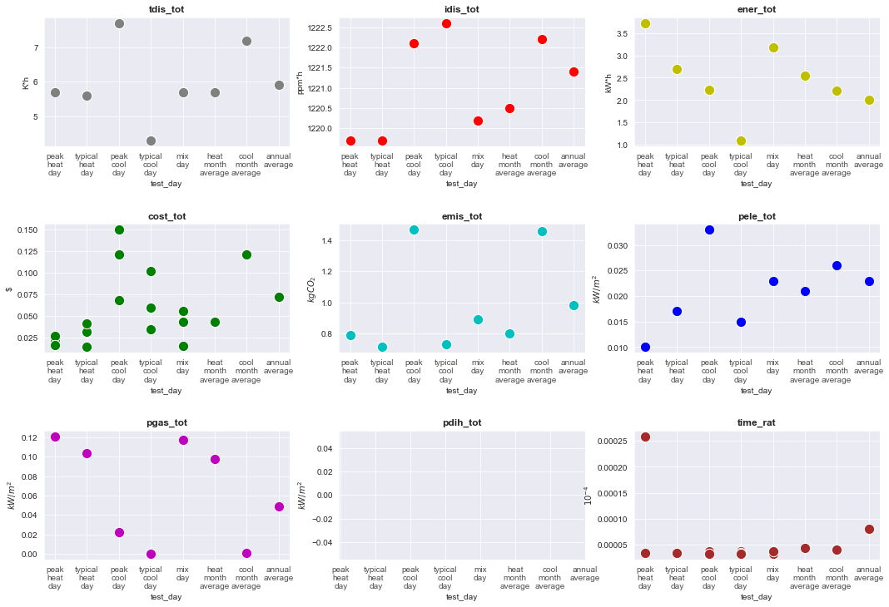
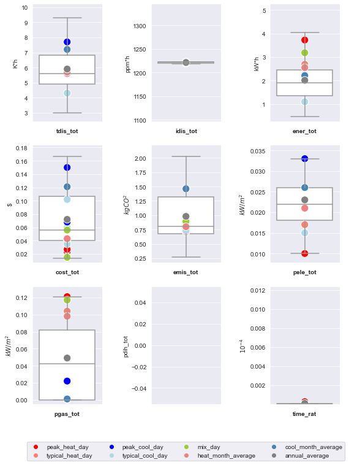
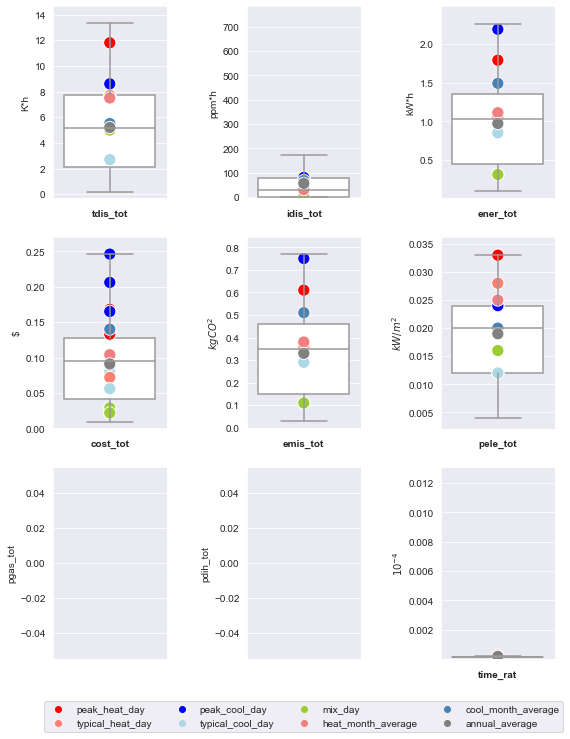
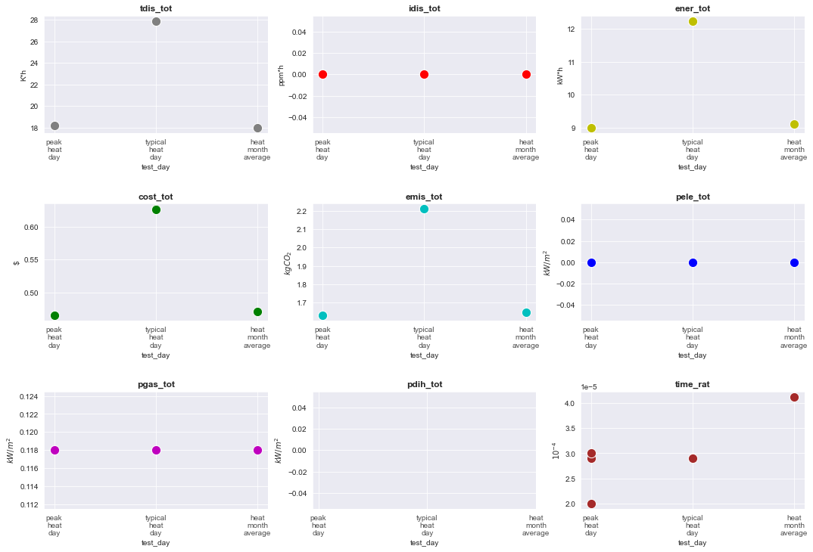
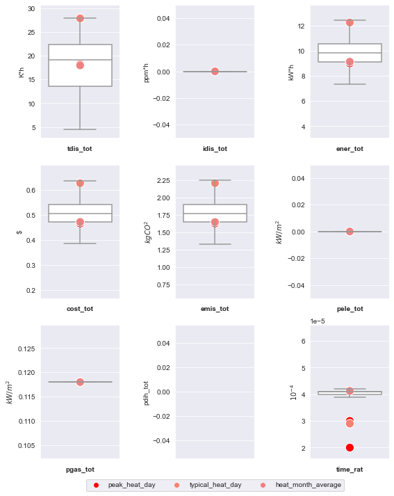
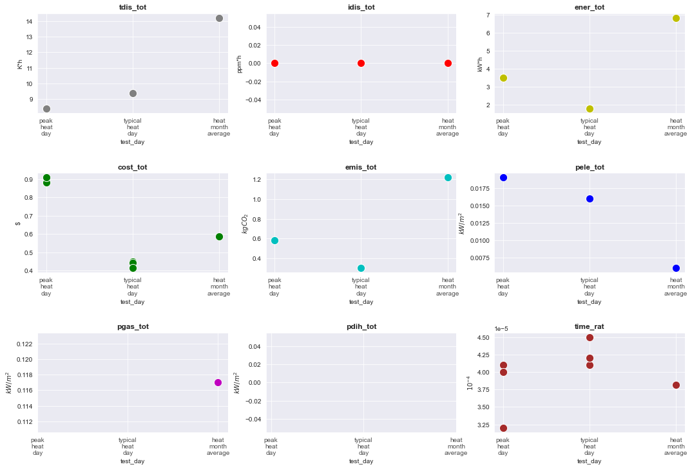
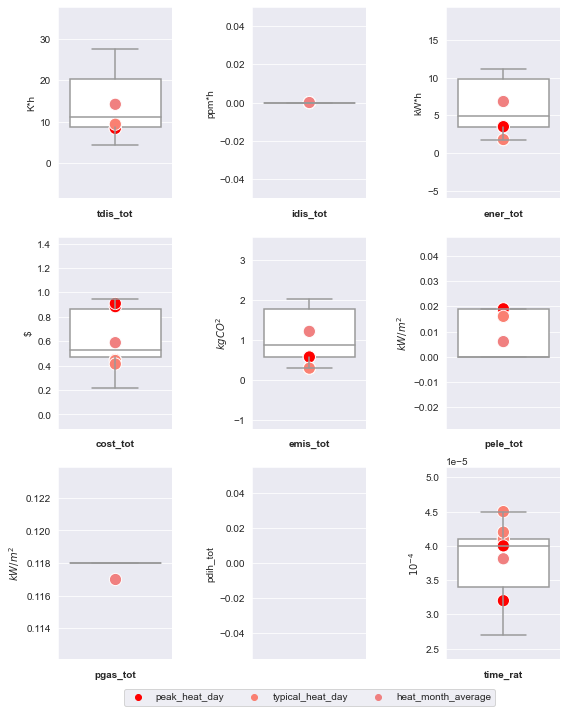
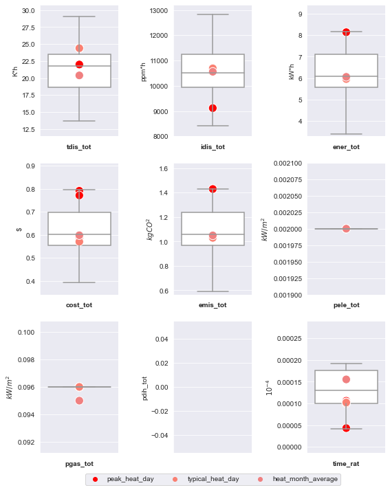
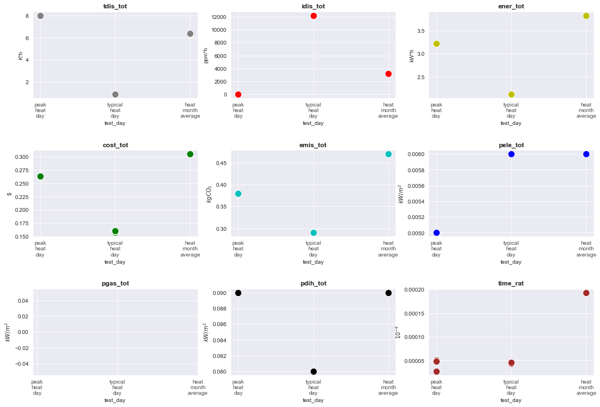
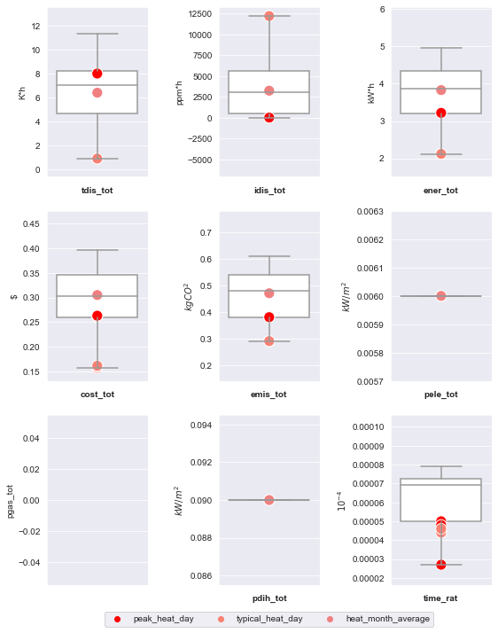

# Baseline Testing

This folder contains examples and results for performing testing of baseline controllers for different testcases.

## Baseline Controller Implementation

- The baseline controllers are incorporated in the testcase models.
The control modules for each testcases in ``../controllers`` follow the structure as described above 
(see upper directory ``README.md`` for instructions on deploying a control test case).
The function ``compute_control`` is psuedo. The control inputs will not be overwritten by this external controller. 

- For test scripts for performing the baseline control test, user could specify the combination of
simulation start, warmup_period, and length or a predefined test case scenario. For the default setting of the baseline tests,
 scenarios with different electricity prices and time periods will be  simulated. 

## Run an Example Baseline Test
- First, deploy the test case corresponding to the desired example as described above (see repository root ``README.md`` for instructions on deploying a test case).
- Then, use ``$ python testcase<...>.py`` depending on the desired example from those defined above.

## Baseline Testing Results
Two-week simulation are conducted with different electricity prices and representative time periods for the following testcases:
1. [bestest_air](#1._bestest_air)
2. [multizone_office_simple_air](#2._multizone_office_simple_air)
3. [bestest_hydronic](#3._bestest_hydronic)
4. [bestest_hydronic_heat_pump](#4._bestest_hydronic_heat_pump)
5. [multizone_residential_hydronic](#5._multizone_residential_hydronic)
6. [singlezone_commercial_hydronic](#6._singlezone_commercial_hydronic)

Please see ``root/Testcases`` ``README.md`` for different predefined scenarios for each testcase. 
For each scenario, one week simulation before ``time_period`` is conducted for the warm-up and two-week simulation is then conducted.
The results of these representative scenarios are also compared with the average results of one year/heating season (that depends on the testcases) with a rolling window of two weeks.

### Summary results for all the testcases

The following table shows the statistics of the KPIs for all the testcases. 

|       |   tdis_tot |   idis_tot |   ener_tot |   cost_tot |   emis_tot |   pele_tot |   pgas_tot |   pdih_tot |     time_rat |
|:------|-----------:|-----------:|-----------:|-----------:|-----------:|-----------:|-----------:|-----------:|-------------:|
| mean  |   10.2222  |    2122.74 |    3.61333 |   0.279407 |   0.808889 |  0.0145    |  0.088     | 0.085      |  6.14259e-05 |
| std   |    7.56388 |    3926.85 |    3.14719 |   0.275812 |   0.547659 |  0.0105933 |  0.0432533 | 0.00547723 |  4.05991e-05 |
| min   |    0.9     |       0    |    0.31    |   0.014    |   0.11     |  0         |  0         | 0.08       |  2e-05       |
| 25%   |    5.6     |       0    |    1.77    |   0.057    |   0.36     |  0.005     |  0.096     | 0.08       |  3.3e-05     |
| 50%   |    7.85    |      50.1  |    2.46    |   0.1605   |   0.72     |  0.0155    |  0.104     | 0.085      |  4.35e-05    |
| 75%   |   11.8     |    1222.1  |    3.72    |   0.46575  |   1.03     |  0.023     |  0.118     | 0.09       |  9.55e-05    |
| max   |   27.9     |   12196.2  |   12.24    |   0.909    |   2.21     |  0.033     |  0.121     | 0.09       |  0.000259    |

### Summary results for each testcase

For each testcase, the baseline testing results are visualized by a scatterplot and a boxplot to show the KPI ranges in different scenarios. Note that the baseline controls do not use price signal information, and therefore the KPI results are the same for  scenarios price different electricity prices expect the total cost and controller computation time ratio. 

#### 1. bestest_air

- Summary Table 

|    | price          | test_day           |   tdis_tot |   idis_tot |   ener_tot |   cost_tot |   emis_tot |   pele_tot |   pgas_tot |   pdih_tot |    time_rat |
|---:|:---------------|:-------------------|-----------:|-----------:|-----------:|-----------:|-----------:|-----------:|-----------:|-----------:|------------:|
|  0 | constant       | peak_heat_day      |        5.7 |     1219.7 |       3.72 |      0.023 |       0.79 |      0.01  |      0.121 |        nan | 0.000259    |
|  1 | constant       | typical_heat_day   |        5.6 |     1219.7 |       2.69 |      0.032 |       0.71 |      0.017 |      0.104 |        nan | 3.2e-05     |
|  2 | constant       | peak_cool_day      |        7.7 |     1222.1 |       2.23 |      0.121 |       1.47 |      0.033 |      0.022 |        nan | 3.7e-05     |
|  3 | constant       | typical_cool_day   |        4.3 |     1222.6 |       1.1  |      0.06  |       0.73 |      0.015 |      0     |        nan | 3.6e-05     |
|  4 | constant       | mix_day            |        5.7 |     1220.2 |       3.18 |      0.043 |       0.89 |      0.023 |      0.117 |        nan | 3.3e-05     |
|  5 | dynamic        | peak_heat_day      |        5.7 |     1219.7 |       3.72 |      0.027 |       0.79 |      0.01  |      0.121 |        nan | 3.3e-05     |
|  6 | dynamic        | typical_heat_day   |        5.6 |     1219.7 |       2.69 |      0.041 |       0.71 |      0.017 |      0.104 |        nan | 3.3e-05     |
|  7 | dynamic        | peak_cool_day      |        7.7 |     1222.1 |       2.23 |      0.15  |       1.47 |      0.033 |      0.022 |        nan | 3.2e-05     |
|  8 | dynamic        | typical_cool_day   |        4.3 |     1222.6 |       1.1  |      0.102 |       0.73 |      0.015 |      0     |        nan | 3.3e-05     |
|  9 | dynamic        | mix_day            |        5.7 |     1220.2 |       3.18 |      0.056 |       0.89 |      0.023 |      0.117 |        nan | 3.2e-05     |
| 10 | highly_dynamic | peak_heat_day      |        5.7 |     1219.7 |       3.72 |      0.016 |       0.79 |      0.01  |      0.121 |        nan | 3.3e-05     |
| 11 | highly_dynamic | typical_heat_day   |        5.6 |     1219.7 |       2.69 |      0.014 |       0.71 |      0.017 |      0.104 |        nan | 3.3e-05     |
| 12 | highly_dynamic | peak_cool_day      |        7.7 |     1222.1 |       2.23 |      0.068 |       1.47 |      0.033 |      0.022 |        nan | 3.2e-05     |
| 13 | highly_dynamic | typical_cool_day   |        4.3 |     1222.6 |       1.1  |      0.035 |       0.73 |      0.015 |      0     |        nan | 3.2e-05     |
| 14 | highly_dynamic | mix_day            |        5.7 |     1220.2 |       3.18 |      0.015 |       0.89 |      0.023 |      0.117 |        nan | 3.7e-05     |
| 15 | constant       | heat_month_average |        5.7 |     1220.5 |       2.55 |      0.043 |       0.8  |      0.021 |      0.098 |        nan | 4.35484e-05 |
| 16 | constant       | cool_month_average |        7.2 |     1222.2 |       2.21 |      0.121 |       1.46 |      0.026 |      0.001 |        nan | 4.06667e-05 |
| 17 | constant       | annual_average     |        5.9 |     1221.4 |       2.01 |      0.072 |       0.98 |      0.023 |      0.049 |        nan | 8.07673e-05 |

- Scatter Plot

  

- Box Plot

  

#### 2. multizone_office_simple_air

- Scatter Plot

  

- Box Plot

  

#### 3. bestest_hydronic

- Scatter Plot

  

- Box Plot

  

#### 4. bestest_hydronic_heat_pump

- Scatter Plot

  

- Box Plot

  

#### 5. multizone_residential_hydronic

- Scatter Plot

  

- Box Plot

  

#### 6. singlezone_commercial_hydronic

- Scatter Plot

  

- Box Plot

  

