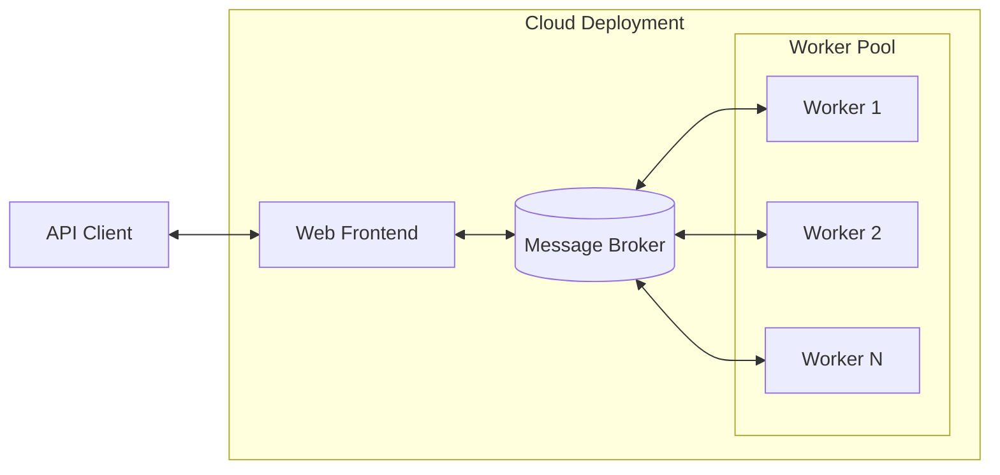

# BOPTEST-Service

This software extends [BOPTEST](https://github.com/ibpsa/project1-boptest) to a web service architecture, which enables support for multiple clients and multiple simultaneous tests at a large scale. This is a containerized design that can be deployed on a personal computer, however the software is targeted at commercial cloud computing environments such as AWS. For details about BOPTEST, refer to the project [homepage](https://boptest.net).

BOPTEST-Service is a sibling of [Alfalfa](https://github.com/NREL/alfalfa), which follows the same architecture, but adopts a more general purpose API to support interactive building simulation, whereas the BOPTEST API is designed around predetermined test scenarios.

# Getting Started

See the README at the root of this repository.

# BOPTEST-Service APIs

The BOPTEST-Service offers a number of additional APIs on top of those listed in the root of this repository for the purpose of managing test cases and running tests, some of which require authorization.

| Description                                                                                                                 | Request                                                    |
| --------------------------------------------------------------------------------------------------------------------------- | -------------------------------------------
| List official BOPTEST test cases.                                                                                           | GET `testcases`                                            |
| List unofficial test cases in a namespace.                                                                                  | GET `testcases/{namespace}`                                |
| List private user test cases. (Auth required)                                                                               | GET `users/{username}/testcases/`                          |
| Check if specific test case exists.                                                                                         | GET `testcases/{testcase_name}`                            |
| Check if specific test case exists in the namespace.                                                                        | GET `testcases/{namespace}/{testcase_name}`                |
| Check if specific private user test case exists.                                                                            | GET `users/{username}/testcases/{testcase_name}`           |
| Select a test case and begin a new test. (Auth optional)                                                                    | POST ``testcases/{testcase_name}/select``                  |
| Select a test case from the namespace and begin a new test. (Auth optional)                                                 | POST ``testcases/{namespace}/{testcase_name}/select``      |
| Select a private user test case and begin a new test. (Auth required)                                                       | POST ``users/{username}/testcases/{testcase_name}/select`` |
| Get test status as `Running` or `Queued`                                                                                    | GET ``status/{testid}``                                    |
| Stop a queued or running test.                                                                                              | PUT ``stop/{testid}``                                      |
| List tests for a user. (Auth required)                                                                                      | GET ``users/{username}/tests``                             |

The family of the `select` APIs are used to choose a test case and begin a running test. Select returns a `testid` which is required by all APIs that interact with the test or provide test information.

# Kubernetes Based Deployment

NREL maintains a helm chart for Kubernetes based deployments of BOPTEST-Service.

# Running the developer Test Suite

Testing is based on the BOPTEST [test suite](https://github.com/NREL/boptest-service/tree/develop/boptest/testing) with small adaptations to conform to the BOPTEST-Service API. Follow the [README](https://github.com/NREL/boptest-service/blob/develop/boptest/testing/README.md) for more information.
