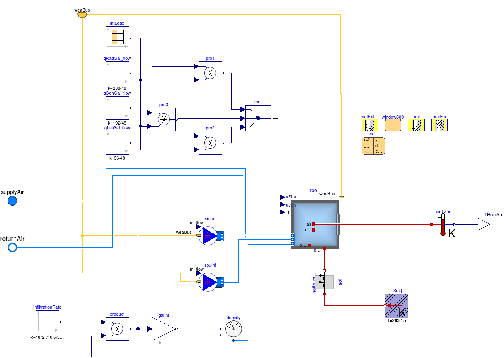

=================
Model Description
=================

The system model is based on the single zone VAV model defined in the Modelica Buildings Library v6.0.0,2018-06-14: ``Buildings.Air.Systems.SingleZone.VAV.Examples.ChillerDXHeatingEconomizer``.  The model has three main components: envelope, HVAC system, and control system, presented in the Figures 1 and 2.  This building specification was chosen due its small size while containing many common HVAC components, reducing the complexity of initial implementation into the BOPTEST framework while maintaining equipment components common in HVAC systems.

.. figure:: images/schematic.png
   :scale: 50 %

   Figure 1 – Schematic of the Single Zone VAV model with key control points (green).

.. figure:: images/modelicaWhole.png
   :scale: 35 %
   :alt: map to buried treasure

   Figure 2 – Modelica implementation of the Single Zone VAV model.

The zone model is based on the BESTEST Case 600 building model as implemented in ``Buildings.ThermalZones.Detailed.Validation.BESTEST.Cases6xx.Case600FF``, modified to allow for a time-varying internal gain schedule and air-based HVAC system.  The internal gain schedule is 1.0 of the design value during occupied hours (8am to 6pm) and 0.1 during unoccupied hours.  The design internal loads are 6 W/m2 radiant, 4 W/m2 convective, and 2 W/m2 latent.  The infiltration rate is a constant 0.5 ACH.  The HVAC system is a single zone VAV system with variable speed supply fan, cooling coil, electric resistance heating coil, mixing box with economizer, and air-cooled chiller.

The control of the system is based on single maximum VAV heating and cooling, depicted in Figure 3.  During cooling, the supply air temperature is held constant while the flow of air is modulated by the supply fan using a proportional feedback controller with gain ``kFan`` to maintain thermostat cooling setpoint.  The supply fan model is a flow-controlled mover with hydraulic efficiency of 0.7, motor efficiency of 0.7 (with heat added to stream), and nominal pressure rise of 875 Pa.  The chilled water pump and air-cooled chiller are on to maintain a chilled water temperature setpoint.  Water flow through the cooling coil is modulated by a three-valve mixing valve, modeled as an ideal flow mixer, in order to maintain the desired supply air temperature using a proportional feedback controller with gain ``kCoo``.  There is currently no implementation of a supply air temperature reset.  The cooling coil is modeled with a dry effectiveness-NTU heat exchanger.  The chilled water pump is modeled as a flow-controlled mover with a hydraulic efficiency of 1.0, motor efficiency of 0.9 (with heat not added to stream), and nominal pressure rise of 12000 Pa.  The chiller uses an electric EIR chiller model with a nominal COP of 5.5.  The economizer, modeled as an ideal flow mixer, supplies the minimum amount of outside air, unless the outside air dry bulb temperature is less than the return air temperature, in which case the outside air damper is modulated to maintain the supply air temperature using a proportional feedback controller with gain ``kEco``.  If the outside air damper is fully open and the supply air temperature is not met, additional cooling is supplied by the cooling coil to meet the desired supply air temperature.  There is currently no implementation of a minimum outside air flow reset, which may result from demand controlled ventilation.  During heating, the supply airflow is held to a constant, with minimum outside air ventilation, and the heating coil is modulated to maintain zone temperature using a proportional feedback controller with gain ``kHea``.  The heating coil is modeled as an ideal fluid heater with a 0.99 efficiency, which assumes electric resistance heat.

.. figure:: images/singleMax.png
   :scale: 50 %

   Figure 3 – Single maximum control for a zone in a VAV system.

   Figure 4 – Modelica implementation of the Single Zone VAV zone model.

.. figure:: images/modelicaRTU.png
   :scale: 35 %

   Figure 5 – Modelica implementation of the Single Zone VAV RTU model.

.. figure:: images/modelicaControl.png
   :scale: 35 %

   Figure 6 – Modelica implementation of the Single Zone VAV control model.

Throughout the HVAC system, the media model for air is moist with decoupled temperature and air, so that the heating or cooling of air in a volume does not change its specific volume.  The media model for water is incompressible with constant specific heat capacities at constant pressure and volume equal to 4184 J/kg-K.  All pressure drops through the air and water systems for the movers to overcome are collapsed into one flow resistance in each system.  Finally, weather data is obtained from an EPW file.

As seen in Figure 2, there are currently two inputs to the model and 10 outputs.  The two inputs are zone cooling and heating thermostat setpoints [K].  The outputs are the power consumption [W] and total energy consumption [J] of the fan, chiller, heater, and pump, as well as the total HVAC energy consumption [J] and measured zone temperature [K].

The model is simulated for one year using constant cooling and heating setpoint temperatures of 25 °C and 20 °C respectively and the DRYCOLD.epw weather file, which is used for BESTEST models.  Dymola 2018 x64 is used for the simulation and the CVode solver with a tolerance of 1E-6 for integration and an output interval of one hour.  KPIs are shown in Table 1 below.  The integration time was 315 seconds.  Simulation occurred on an Ubuntu 16.04 x64 virtual machine with 8 GB memory and (8) 2.67 GHz processors.

+-------------------+--------------------+-----------------------+-----------------------+---------------+
|                   |                    |                       |                       |               |
|   Fan Energy [GJ] |   Pump Energy [GJ] |   Cooling Energy [GJ] |   Heating Energy [GJ] |   Total HVAC  |
|                   |                    |                       |                       |   Energy [GJ] |
|                   |                    |                       |                       |               |
+-------------------+--------------------+-----------------------+-----------------------+---------------+
|                   |                    |                       |                       |               |
|   0.5968          |   0.04518          |   8.286               |   31.91               |   40.842      |
|                   |                    |                       |                       |               |
+-------------------+--------------------+-----------------------+-----------------------+---------------+
