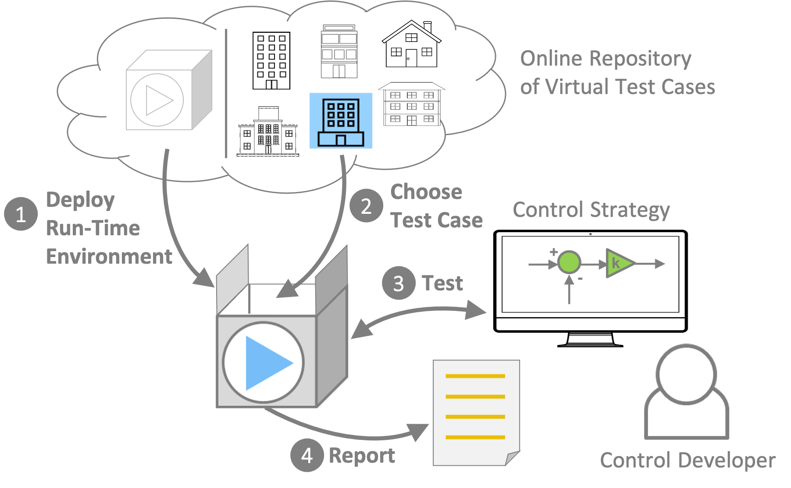

---
# Feel free to add content and custom Front Matter to this file.
# To modify the layout, see https://jekyllrb.com/docs/themes/#overriding-theme-defaults

title: The Building Optimization Testing Framework (BOPTEST)
subtitle: A framework for building control performance benchmarking
hero_height: is-fullwidth
---

    

BOPTEST is designed to facilitate the performance evaluation and benchmarking of building control strategies.
It contains these key components:

1. **Run-Time Environment (RTE)**: An environment accessible with a RESTful HTTP API that is used to start a building emulator, set up tests, control the virtual systems, access data, and report KPIs.

2. **Test Case Repository**: A collection of ready-to-use building emulators representing a range of building types and HVAC systems.

3. **Key Performance Indicator (KPI) Reporting**: A set of KPIs calculated by the RTE using data from the building emulator being controlled.

Head over to the [Software](/project1-boptest/software/index.html) page to start testing your control strategy or look at the [Results Dashboard](/project1-boptest/dashboard/index.html) to view and compare tested control strategies.

Stay up to date on the latest [News](/project1-boptest/blog/index.html), participate in the [Discussion](https://github.com/ibpsa/project1-boptest/discussions), or join our google group [Mailing List](https://groups.google.com/g/ibpsa-boptest).

# Collaboration and Support

The development of BOPTEST has resulted from an international collaboration of academic, research, and industry partners through [IBPSA Project 1](https://ibpsa.github.io/project1/index.html) Work Package 1.2 and continuing under [IBPSA Project 2](/project1-boptest/ibpsa/index.html).  Thank you to all of the [contributing partners](/project1-boptest/contributors/index.html)!

Financial support provided in-part by:

- U.S. Department of Energy Building Technologies Office
- Flemish Institute for Technological Research (VITO)
- KU Leuven
- Centres for Environment-friendly Energy Research (FME) Research Centre on Zero Emission Neighbourhoods (ZEN) in Smart Cities
- Engie
- EU-H2020
- VLAIO
- Arup

BOPTEST uses the open modeling language [Modelica](https://modelica.org/) and standard [FMI](https://fmi-standard.org/).

### Contact
David Blum, Lawrence Berkeley National Laboratory, dhblum@lbl.gov

Lieve Helsen, KU Leuven, lieve.helsen@kuleuven.be
